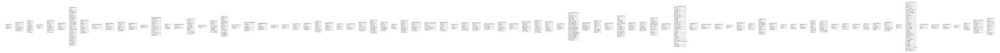

# Database Schema

## テーブル一覧

| 名前                                                        | カラム一覧      | コメント     | タイプ        |
| --------------------------------------------------------- | ---------- | -------- | ---------- |
| [access](access.md)                                       | 4          |          | BASE TABLE |
| [access_token](access_token.md)                           | 8          |          | BASE TABLE |
| [action](action.md)                                       | 11         |          | BASE TABLE |
| [app_state](app_state.md)                                 | 3          |          | BASE TABLE |
| [attachment](attachment.md)                               | 11         |          | BASE TABLE |
| [collaboration](collaboration.md)                         | 6          |          | BASE TABLE |
| [comment](comment.md)                                     | 36         |          | BASE TABLE |
| [commit_status](commit_status.md)                         | 12         |          | BASE TABLE |
| [commit_status_index](commit_status_index.md)             | 4          |          | BASE TABLE |
| [deleted_branch](deleted_branch.md)                       | 6          |          | BASE TABLE |
| [deploy_key](deploy_key.md)                               | 8          |          | BASE TABLE |
| [email_address](email_address.md)                         | 6          |          | BASE TABLE |
| [email_hash](email_hash.md)                               | 2          |          | BASE TABLE |
| [external_login_user](external_login_user.md)             | 17         |          | BASE TABLE |
| [follow](follow.md)                                       | 4          |          | BASE TABLE |
| [foreign_reference](foreign_reference.md)                 | 4          |          | BASE TABLE |
| [gpg_key](gpg_key.md)                                     | 14         |          | BASE TABLE |
| [gpg_key_import](gpg_key_import.md)                       | 2          |          | BASE TABLE |
| [hook_task](hook_task.md)                                 | 11         |          | BASE TABLE |
| [issue](issue.md)                                         | 19         |          | BASE TABLE |
| [issue_assignees](issue_assignees.md)                     | 3          |          | BASE TABLE |
| [issue_content_history](issue_content_history.md)         | 8          |          | BASE TABLE |
| [issue_dependency](issue_dependency.md)                   | 6          |          | BASE TABLE |
| [issue_index](issue_index.md)                             | 2          |          | BASE TABLE |
| [issue_label](issue_label.md)                             | 3          |          | BASE TABLE |
| [issue_user](issue_user.md)                               | 5          |          | BASE TABLE |
| [issue_watch](issue_watch.md)                             | 6          |          | BASE TABLE |
| [label](label.md)                                         | 10         |          | BASE TABLE |
| [language_stat](language_stat.md)                         | 7          |          | BASE TABLE |
| [lfs_lock](lfs_lock.md)                                   | 5          |          | BASE TABLE |
| [lfs_meta_object](lfs_meta_object.md)                     | 5          |          | BASE TABLE |
| [login_source](login_source.md)                           | 8          |          | BASE TABLE |
| [milestone](milestone.md)                                 | 12         |          | BASE TABLE |
| [mirror](mirror.md)                                       | 8          |          | BASE TABLE |
| [notice](notice.md)                                       | 4          |          | BASE TABLE |
| [notification](notification.md)                           | 11         |          | BASE TABLE |
| [oauth2_application](oauth2_application.md)               | 8          |          | BASE TABLE |
| [oauth2_authorization_code](oauth2_authorization_code.md) | 7          |          | BASE TABLE |
| [oauth2_grant](oauth2_grant.md)                           | 8          |          | BASE TABLE |
| [org_user](org_user.md)                                   | 4          |          | BASE TABLE |
| [package](package.md)                                     | 7          |          | BASE TABLE |
| [package_blob](package_blob.md)                           | 7          |          | BASE TABLE |
| [package_blob_upload](package_blob_upload.md)             | 5          |          | BASE TABLE |
| [package_file](package_file.md)                           | 8          |          | BASE TABLE |
| [package_property](package_property.md)                   | 5          |          | BASE TABLE |
| [package_version](package_version.md)                     | 9          |          | BASE TABLE |
| [project](project.md)                                     | 11         |          | BASE TABLE |
| [project_board](project_board.md)                         | 9          |          | BASE TABLE |
| [project_issue](project_issue.md)                         | 5          |          | BASE TABLE |
| [protected_branch](protected_branch.md)                   | 26         |          | BASE TABLE |
| [protected_tag](protected_tag.md)                         | 7          |          | BASE TABLE |
| [public_key](public_key.md)                               | 11         |          | BASE TABLE |
| [pull_auto_merge](pull_auto_merge.md)                     | 6          |          | BASE TABLE |
| [pull_request](pull_request.md)                           | 20         |          | BASE TABLE |
| [push_mirror](push_mirror.md)                             | 7          |          | BASE TABLE |
| [reaction](reaction.md)                                   | 8          |          | BASE TABLE |
| [release](release.md)                                     | 16         |          | BASE TABLE |
| [renamed_branch](renamed_branch.md)                       | 5          |          | BASE TABLE |
| [repository](repository.md)                               | 38         |          | BASE TABLE |
| [repo_archiver](repo_archiver.md)                         | 6          |          | BASE TABLE |
| [repo_indexer_status](repo_indexer_status.md)             | 4          |          | BASE TABLE |
| [repo_redirect](repo_redirect.md)                         | 4          |          | BASE TABLE |
| [repo_topic](repo_topic.md)                               | 2          |          | BASE TABLE |
| [repo_transfer](repo_transfer.md)                         | 7          |          | BASE TABLE |
| [repo_unit](repo_unit.md)                                 | 5          |          | BASE TABLE |
| [review](review.md)                                       | 14         |          | BASE TABLE |
| [review_state](review_state.md)                           | 6          |          | BASE TABLE |
| [session](session.md)                                     | 3          |          | BASE TABLE |
| [star](star.md)                                           | 4          |          | BASE TABLE |
| [stopwatch](stopwatch.md)                                 | 4          |          | BASE TABLE |
| [task](task.md)                                           | 11         |          | BASE TABLE |
| [team](team.md)                                           | 10         |          | BASE TABLE |
| [team_repo](team_repo.md)                                 | 4          |          | BASE TABLE |
| [team_unit](team_unit.md)                                 | 5          |          | BASE TABLE |
| [team_user](team_user.md)                                 | 4          |          | BASE TABLE |
| [topic](topic.md)                                         | 5          |          | BASE TABLE |
| [tracked_time](tracked_time.md)                           | 6          |          | BASE TABLE |
| [two_factor](two_factor.md)                               | 8          |          | BASE TABLE |
| [upload](upload.md)                                       | 3          |          | BASE TABLE |
| [user](user.md)                                           | 46         |          | BASE TABLE |
| [user_open_id](user_open_id.md)                           | 4          |          | BASE TABLE |
| [user_redirect](user_redirect.md)                         | 3          |          | BASE TABLE |
| [user_setting](user_setting.md)                           | 4          |          | BASE TABLE |
| [version](version.md)                                     | 2          |          | BASE TABLE |
| [watch](watch.md)                                         | 6          |          | BASE TABLE |
| [webauthn_credential](webauthn_credential.md)             | 12         |          | BASE TABLE |
| [webhook](webhook.md)                                     | 15         |          | BASE TABLE |

## ER図

---

> Generated by [tbls](https://github.com/k1LoW/tbls)
