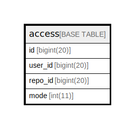

# access

## 概要

<details>
<summary><strong>テーブル定義</strong></summary>

```sql
CREATE TABLE `access` (
  `id` bigint(20) NOT NULL AUTO_INCREMENT,
  `user_id` bigint(20) DEFAULT NULL,
  `repo_id` bigint(20) DEFAULT NULL,
  `mode` int(11) DEFAULT NULL,
  PRIMARY KEY (`id`),
  UNIQUE KEY `UQE_access_s` (`user_id`,`repo_id`)
) ENGINE=InnoDB DEFAULT CHARSET=utf8mb4 ROW_FORMAT=DYNAMIC
```

</details>

## カラム一覧

| 名前      | タイプ        | デフォルト値       | NULL許可   | Extra Definition | 子テーブル      | 親テーブル      | コメント     |
| ------- | ---------- | ------------ | -------- | ---------------- | ---------- | ---------- | -------- |
| id      | bigint(20) |              | false    | auto_increment   |            |            |          |
| user_id | bigint(20) | NULL         | true     |                  |            |            |          |
| repo_id | bigint(20) | NULL         | true     |                  |            |            |          |
| mode    | int(11)    | NULL         | true     |                  |            |            |          |

## 制約一覧

| 名前           | タイプ         | 定義                                         |
| ------------ | ----------- | ------------------------------------------ |
| PRIMARY      | PRIMARY KEY | PRIMARY KEY (id)                           |
| UQE_access_s | UNIQUE      | UNIQUE KEY UQE_access_s (user_id, repo_id) |

## INDEX一覧

| 名前           | 定義                                                     |
| ------------ | ------------------------------------------------------ |
| PRIMARY      | PRIMARY KEY (id) USING BTREE                           |
| UQE_access_s | UNIQUE KEY UQE_access_s (user_id, repo_id) USING BTREE |

## ER図



---

> Generated by [tbls](https://github.com/k1LoW/tbls)
