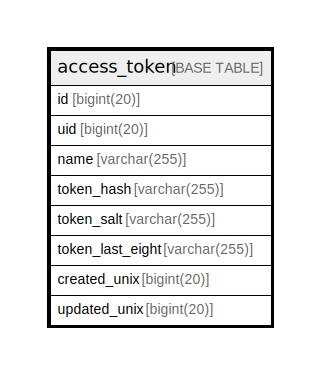

# access_token

## 概要

<details>
<summary><strong>テーブル定義</strong></summary>

```sql
CREATE TABLE `access_token` (
  `id` bigint(20) NOT NULL AUTO_INCREMENT,
  `uid` bigint(20) DEFAULT NULL,
  `name` varchar(255) DEFAULT NULL,
  `token_hash` varchar(255) DEFAULT NULL,
  `token_salt` varchar(255) DEFAULT NULL,
  `token_last_eight` varchar(255) DEFAULT NULL,
  `created_unix` bigint(20) DEFAULT NULL,
  `updated_unix` bigint(20) DEFAULT NULL,
  PRIMARY KEY (`id`),
  UNIQUE KEY `UQE_access_token_token_hash` (`token_hash`),
  KEY `IDX_access_token_created_unix` (`created_unix`),
  KEY `IDX_access_token_updated_unix` (`updated_unix`),
  KEY `IDX_access_token_uid` (`uid`)
) ENGINE=InnoDB DEFAULT CHARSET=utf8mb4 ROW_FORMAT=DYNAMIC
```

</details>

## カラム一覧

| 名前               | タイプ          | デフォルト値       | NULL許可   | Extra Definition | 子テーブル      | 親テーブル      | コメント     |
| ---------------- | ------------ | ------------ | -------- | ---------------- | ---------- | ---------- | -------- |
| id               | bigint(20)   |              | false    | auto_increment   |            |            |          |
| uid              | bigint(20)   | NULL         | true     |                  |            |            |          |
| name             | varchar(255) | NULL         | true     |                  |            |            |          |
| token_hash       | varchar(255) | NULL         | true     |                  |            |            |          |
| token_salt       | varchar(255) | NULL         | true     |                  |            |            |          |
| token_last_eight | varchar(255) | NULL         | true     |                  |            |            |          |
| created_unix     | bigint(20)   | NULL         | true     |                  |            |            |          |
| updated_unix     | bigint(20)   | NULL         | true     |                  |            |            |          |

## 制約一覧

| 名前                          | タイプ         | 定義                                                  |
| --------------------------- | ----------- | --------------------------------------------------- |
| PRIMARY                     | PRIMARY KEY | PRIMARY KEY (id)                                    |
| UQE_access_token_token_hash | UNIQUE      | UNIQUE KEY UQE_access_token_token_hash (token_hash) |

## INDEX一覧

| 名前                            | 定義                                                              |
| ----------------------------- | --------------------------------------------------------------- |
| IDX_access_token_created_unix | KEY IDX_access_token_created_unix (created_unix) USING BTREE    |
| IDX_access_token_uid          | KEY IDX_access_token_uid (uid) USING BTREE                      |
| IDX_access_token_updated_unix | KEY IDX_access_token_updated_unix (updated_unix) USING BTREE    |
| PRIMARY                       | PRIMARY KEY (id) USING BTREE                                    |
| UQE_access_token_token_hash   | UNIQUE KEY UQE_access_token_token_hash (token_hash) USING BTREE |

## ER図



---

> Generated by [tbls](https://github.com/k1LoW/tbls)
