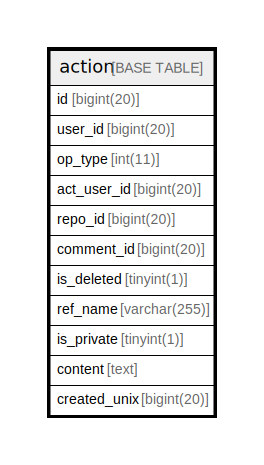

# action

## 概要

<details>
<summary><strong>テーブル定義</strong></summary>

```sql
CREATE TABLE `action` (
  `id` bigint(20) NOT NULL AUTO_INCREMENT,
  `user_id` bigint(20) DEFAULT NULL,
  `op_type` int(11) DEFAULT NULL,
  `act_user_id` bigint(20) DEFAULT NULL,
  `repo_id` bigint(20) DEFAULT NULL,
  `comment_id` bigint(20) DEFAULT NULL,
  `is_deleted` tinyint(1) NOT NULL DEFAULT 0,
  `ref_name` varchar(255) DEFAULT NULL,
  `is_private` tinyint(1) NOT NULL DEFAULT 0,
  `content` text DEFAULT NULL,
  `created_unix` bigint(20) DEFAULT NULL,
  PRIMARY KEY (`id`),
  KEY `IDX_action_comment_id` (`comment_id`),
  KEY `IDX_action_au_r_c_u_d` (`act_user_id`,`repo_id`,`created_unix`,`user_id`,`is_deleted`),
  KEY `IDX_action_r_u_d` (`repo_id`,`user_id`,`is_deleted`)
) ENGINE=InnoDB DEFAULT CHARSET=utf8mb4 ROW_FORMAT=DYNAMIC
```

</details>

## カラム一覧

| 名前           | タイプ          | デフォルト値       | NULL許可   | Extra Definition | 子テーブル      | 親テーブル      | コメント     |
| ------------ | ------------ | ------------ | -------- | ---------------- | ---------- | ---------- | -------- |
| id           | bigint(20)   |              | false    | auto_increment   |            |            |          |
| user_id      | bigint(20)   | NULL         | true     |                  |            |            |          |
| op_type      | int(11)      | NULL         | true     |                  |            |            |          |
| act_user_id  | bigint(20)   | NULL         | true     |                  |            |            |          |
| repo_id      | bigint(20)   | NULL         | true     |                  |            |            |          |
| comment_id   | bigint(20)   | NULL         | true     |                  |            |            |          |
| is_deleted   | tinyint(1)   | 0            | false    |                  |            |            |          |
| ref_name     | varchar(255) | NULL         | true     |                  |            |            |          |
| is_private   | tinyint(1)   | 0            | false    |                  |            |            |          |
| content      | text         | NULL         | true     |                  |            |            |          |
| created_unix | bigint(20)   | NULL         | true     |                  |            |            |          |

## 制約一覧

| 名前      | タイプ         | 定義               |
| ------- | ----------- | ---------------- |
| PRIMARY | PRIMARY KEY | PRIMARY KEY (id) |

## INDEX一覧

| 名前                    | 定義                                                                                              |
| --------------------- | ----------------------------------------------------------------------------------------------- |
| IDX_action_au_r_c_u_d | KEY IDX_action_au_r_c_u_d (act_user_id, repo_id, created_unix, user_id, is_deleted) USING BTREE |
| IDX_action_comment_id | KEY IDX_action_comment_id (comment_id) USING BTREE                                              |
| IDX_action_r_u_d      | KEY IDX_action_r_u_d (repo_id, user_id, is_deleted) USING BTREE                                 |
| PRIMARY               | PRIMARY KEY (id) USING BTREE                                                                    |

## ER図



---

> Generated by [tbls](https://github.com/k1LoW/tbls)
