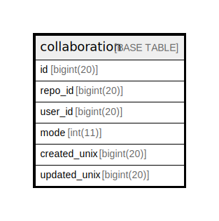

# collaboration

## 概要

<details>
<summary><strong>テーブル定義</strong></summary>

```sql
CREATE TABLE `collaboration` (
  `id` bigint(20) NOT NULL AUTO_INCREMENT,
  `repo_id` bigint(20) NOT NULL,
  `user_id` bigint(20) NOT NULL,
  `mode` int(11) NOT NULL DEFAULT 2,
  `created_unix` bigint(20) DEFAULT NULL,
  `updated_unix` bigint(20) DEFAULT NULL,
  PRIMARY KEY (`id`),
  UNIQUE KEY `UQE_collaboration_s` (`repo_id`,`user_id`),
  KEY `IDX_collaboration_created_unix` (`created_unix`),
  KEY `IDX_collaboration_updated_unix` (`updated_unix`),
  KEY `IDX_collaboration_repo_id` (`repo_id`),
  KEY `IDX_collaboration_user_id` (`user_id`)
) ENGINE=InnoDB DEFAULT CHARSET=utf8mb4 ROW_FORMAT=DYNAMIC
```

</details>

## カラム一覧

| 名前           | タイプ        | デフォルト値       | NULL許可   | Extra Definition | 子テーブル      | 親テーブル      | コメント     |
| ------------ | ---------- | ------------ | -------- | ---------------- | ---------- | ---------- | -------- |
| id           | bigint(20) |              | false    | auto_increment   |            |            |          |
| repo_id      | bigint(20) |              | false    |                  |            |            |          |
| user_id      | bigint(20) |              | false    |                  |            |            |          |
| mode         | int(11)    | 2            | false    |                  |            |            |          |
| created_unix | bigint(20) | NULL         | true     |                  |            |            |          |
| updated_unix | bigint(20) | NULL         | true     |                  |            |            |          |

## 制約一覧

| 名前                  | タイプ         | 定義                                                |
| ------------------- | ----------- | ------------------------------------------------- |
| PRIMARY             | PRIMARY KEY | PRIMARY KEY (id)                                  |
| UQE_collaboration_s | UNIQUE      | UNIQUE KEY UQE_collaboration_s (repo_id, user_id) |

## INDEX一覧

| 名前                             | 定義                                                            |
| ------------------------------ | ------------------------------------------------------------- |
| IDX_collaboration_created_unix | KEY IDX_collaboration_created_unix (created_unix) USING BTREE |
| IDX_collaboration_repo_id      | KEY IDX_collaboration_repo_id (repo_id) USING BTREE           |
| IDX_collaboration_updated_unix | KEY IDX_collaboration_updated_unix (updated_unix) USING BTREE |
| IDX_collaboration_user_id      | KEY IDX_collaboration_user_id (user_id) USING BTREE           |
| PRIMARY                        | PRIMARY KEY (id) USING BTREE                                  |
| UQE_collaboration_s            | UNIQUE KEY UQE_collaboration_s (repo_id, user_id) USING BTREE |

## ER図



---

> Generated by [tbls](https://github.com/k1LoW/tbls)
