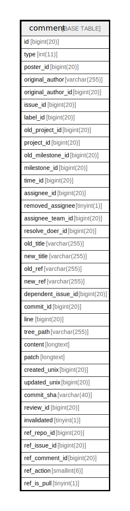

# comment

## 概要

<details>
<summary><strong>テーブル定義</strong></summary>

```sql
CREATE TABLE `comment` (
  `id` bigint(20) NOT NULL AUTO_INCREMENT,
  `type` int(11) DEFAULT NULL,
  `poster_id` bigint(20) DEFAULT NULL,
  `original_author` varchar(255) DEFAULT NULL,
  `original_author_id` bigint(20) DEFAULT NULL,
  `issue_id` bigint(20) DEFAULT NULL,
  `label_id` bigint(20) DEFAULT NULL,
  `old_project_id` bigint(20) DEFAULT NULL,
  `project_id` bigint(20) DEFAULT NULL,
  `old_milestone_id` bigint(20) DEFAULT NULL,
  `milestone_id` bigint(20) DEFAULT NULL,
  `time_id` bigint(20) DEFAULT NULL,
  `assignee_id` bigint(20) DEFAULT NULL,
  `removed_assignee` tinyint(1) DEFAULT NULL,
  `assignee_team_id` bigint(20) NOT NULL DEFAULT 0,
  `resolve_doer_id` bigint(20) DEFAULT NULL,
  `old_title` varchar(255) DEFAULT NULL,
  `new_title` varchar(255) DEFAULT NULL,
  `old_ref` varchar(255) DEFAULT NULL,
  `new_ref` varchar(255) DEFAULT NULL,
  `dependent_issue_id` bigint(20) DEFAULT NULL,
  `commit_id` bigint(20) DEFAULT NULL,
  `line` bigint(20) DEFAULT NULL,
  `tree_path` varchar(255) DEFAULT NULL,
  `content` longtext DEFAULT NULL,
  `patch` longtext DEFAULT NULL,
  `created_unix` bigint(20) DEFAULT NULL,
  `updated_unix` bigint(20) DEFAULT NULL,
  `commit_sha` varchar(40) DEFAULT NULL,
  `review_id` bigint(20) DEFAULT NULL,
  `invalidated` tinyint(1) DEFAULT NULL,
  `ref_repo_id` bigint(20) DEFAULT NULL,
  `ref_issue_id` bigint(20) DEFAULT NULL,
  `ref_comment_id` bigint(20) DEFAULT NULL,
  `ref_action` smallint(6) DEFAULT NULL,
  `ref_is_pull` tinyint(1) DEFAULT NULL,
  PRIMARY KEY (`id`),
  KEY `IDX_comment_type` (`type`),
  KEY `IDX_comment_created_unix` (`created_unix`),
  KEY `IDX_comment_ref_issue_id` (`ref_issue_id`),
  KEY `IDX_comment_ref_repo_id` (`ref_repo_id`),
  KEY `IDX_comment_ref_comment_id` (`ref_comment_id`),
  KEY `IDX_comment_poster_id` (`poster_id`),
  KEY `IDX_comment_issue_id` (`issue_id`),
  KEY `IDX_comment_updated_unix` (`updated_unix`),
  KEY `IDX_comment_review_id` (`review_id`)
) ENGINE=InnoDB DEFAULT CHARSET=utf8mb4 ROW_FORMAT=DYNAMIC
```

</details>

## カラム一覧

| 名前                 | タイプ          | デフォルト値       | NULL許可   | Extra Definition | 子テーブル      | 親テーブル      | コメント     |
| ------------------ | ------------ | ------------ | -------- | ---------------- | ---------- | ---------- | -------- |
| id                 | bigint(20)   |              | false    | auto_increment   |            |            |          |
| type               | int(11)      | NULL         | true     |                  |            |            |          |
| poster_id          | bigint(20)   | NULL         | true     |                  |            |            |          |
| original_author    | varchar(255) | NULL         | true     |                  |            |            |          |
| original_author_id | bigint(20)   | NULL         | true     |                  |            |            |          |
| issue_id           | bigint(20)   | NULL         | true     |                  |            |            |          |
| label_id           | bigint(20)   | NULL         | true     |                  |            |            |          |
| old_project_id     | bigint(20)   | NULL         | true     |                  |            |            |          |
| project_id         | bigint(20)   | NULL         | true     |                  |            |            |          |
| old_milestone_id   | bigint(20)   | NULL         | true     |                  |            |            |          |
| milestone_id       | bigint(20)   | NULL         | true     |                  |            |            |          |
| time_id            | bigint(20)   | NULL         | true     |                  |            |            |          |
| assignee_id        | bigint(20)   | NULL         | true     |                  |            |            |          |
| removed_assignee   | tinyint(1)   | NULL         | true     |                  |            |            |          |
| assignee_team_id   | bigint(20)   | 0            | false    |                  |            |            |          |
| resolve_doer_id    | bigint(20)   | NULL         | true     |                  |            |            |          |
| old_title          | varchar(255) | NULL         | true     |                  |            |            |          |
| new_title          | varchar(255) | NULL         | true     |                  |            |            |          |
| old_ref            | varchar(255) | NULL         | true     |                  |            |            |          |
| new_ref            | varchar(255) | NULL         | true     |                  |            |            |          |
| dependent_issue_id | bigint(20)   | NULL         | true     |                  |            |            |          |
| commit_id          | bigint(20)   | NULL         | true     |                  |            |            |          |
| line               | bigint(20)   | NULL         | true     |                  |            |            |          |
| tree_path          | varchar(255) | NULL         | true     |                  |            |            |          |
| content            | longtext     | NULL         | true     |                  |            |            |          |
| patch              | longtext     | NULL         | true     |                  |            |            |          |
| created_unix       | bigint(20)   | NULL         | true     |                  |            |            |          |
| updated_unix       | bigint(20)   | NULL         | true     |                  |            |            |          |
| commit_sha         | varchar(40)  | NULL         | true     |                  |            |            |          |
| review_id          | bigint(20)   | NULL         | true     |                  |            |            |          |
| invalidated        | tinyint(1)   | NULL         | true     |                  |            |            |          |
| ref_repo_id        | bigint(20)   | NULL         | true     |                  |            |            |          |
| ref_issue_id       | bigint(20)   | NULL         | true     |                  |            |            |          |
| ref_comment_id     | bigint(20)   | NULL         | true     |                  |            |            |          |
| ref_action         | smallint(6)  | NULL         | true     |                  |            |            |          |
| ref_is_pull        | tinyint(1)   | NULL         | true     |                  |            |            |          |

## 制約一覧

| 名前      | タイプ         | 定義               |
| ------- | ----------- | ---------------- |
| PRIMARY | PRIMARY KEY | PRIMARY KEY (id) |

## INDEX一覧

| 名前                         | 定義                                                          |
| -------------------------- | ----------------------------------------------------------- |
| IDX_comment_created_unix   | KEY IDX_comment_created_unix (created_unix) USING BTREE     |
| IDX_comment_issue_id       | KEY IDX_comment_issue_id (issue_id) USING BTREE             |
| IDX_comment_poster_id      | KEY IDX_comment_poster_id (poster_id) USING BTREE           |
| IDX_comment_ref_comment_id | KEY IDX_comment_ref_comment_id (ref_comment_id) USING BTREE |
| IDX_comment_ref_issue_id   | KEY IDX_comment_ref_issue_id (ref_issue_id) USING BTREE     |
| IDX_comment_ref_repo_id    | KEY IDX_comment_ref_repo_id (ref_repo_id) USING BTREE       |
| IDX_comment_review_id      | KEY IDX_comment_review_id (review_id) USING BTREE           |
| IDX_comment_type           | KEY IDX_comment_type (type) USING BTREE                     |
| IDX_comment_updated_unix   | KEY IDX_comment_updated_unix (updated_unix) USING BTREE     |
| PRIMARY                    | PRIMARY KEY (id) USING BTREE                                |

## ER図



---

> Generated by [tbls](https://github.com/k1LoW/tbls)
