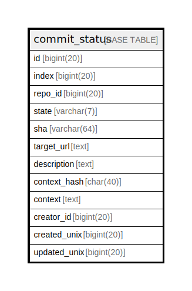

# commit_status

## 概要

<details>
<summary><strong>テーブル定義</strong></summary>

```sql
CREATE TABLE `commit_status` (
  `id` bigint(20) NOT NULL AUTO_INCREMENT,
  `index` bigint(20) DEFAULT NULL,
  `repo_id` bigint(20) DEFAULT NULL,
  `state` varchar(7) NOT NULL,
  `sha` varchar(64) NOT NULL,
  `target_url` text DEFAULT NULL,
  `description` text DEFAULT NULL,
  `context_hash` char(40) DEFAULT NULL,
  `context` text DEFAULT NULL,
  `creator_id` bigint(20) DEFAULT NULL,
  `created_unix` bigint(20) DEFAULT NULL,
  `updated_unix` bigint(20) DEFAULT NULL,
  PRIMARY KEY (`id`),
  UNIQUE KEY `UQE_commit_status_repo_sha_index` (`index`,`repo_id`,`sha`),
  KEY `IDX_commit_status_repo_id` (`repo_id`),
  KEY `IDX_commit_status_sha` (`sha`),
  KEY `IDX_commit_status_context_hash` (`context_hash`),
  KEY `IDX_commit_status_created_unix` (`created_unix`),
  KEY `IDX_commit_status_updated_unix` (`updated_unix`),
  KEY `IDX_commit_status_index` (`index`)
) ENGINE=InnoDB DEFAULT CHARSET=utf8mb4 ROW_FORMAT=DYNAMIC
```

</details>

## カラム一覧

| 名前           | タイプ         | デフォルト値       | NULL許可   | Extra Definition | 子テーブル      | 親テーブル      | コメント     |
| ------------ | ----------- | ------------ | -------- | ---------------- | ---------- | ---------- | -------- |
| id           | bigint(20)  |              | false    | auto_increment   |            |            |          |
| index        | bigint(20)  | NULL         | true     |                  |            |            |          |
| repo_id      | bigint(20)  | NULL         | true     |                  |            |            |          |
| state        | varchar(7)  |              | false    |                  |            |            |          |
| sha          | varchar(64) |              | false    |                  |            |            |          |
| target_url   | text        | NULL         | true     |                  |            |            |          |
| description  | text        | NULL         | true     |                  |            |            |          |
| context_hash | char(40)    | NULL         | true     |                  |            |            |          |
| context      | text        | NULL         | true     |                  |            |            |          |
| creator_id   | bigint(20)  | NULL         | true     |                  |            |            |          |
| created_unix | bigint(20)  | NULL         | true     |                  |            |            |          |
| updated_unix | bigint(20)  | NULL         | true     |                  |            |            |          |

## 制約一覧

| 名前                               | タイプ         | 定義                                                                |
| -------------------------------- | ----------- | ----------------------------------------------------------------- |
| PRIMARY                          | PRIMARY KEY | PRIMARY KEY (id)                                                  |
| UQE_commit_status_repo_sha_index | UNIQUE      | UNIQUE KEY UQE_commit_status_repo_sha_index (index, repo_id, sha) |

## INDEX一覧

| 名前                               | 定義                                                                            |
| -------------------------------- | ----------------------------------------------------------------------------- |
| IDX_commit_status_context_hash   | KEY IDX_commit_status_context_hash (context_hash) USING BTREE                 |
| IDX_commit_status_created_unix   | KEY IDX_commit_status_created_unix (created_unix) USING BTREE                 |
| IDX_commit_status_index          | KEY IDX_commit_status_index (index) USING BTREE                               |
| IDX_commit_status_repo_id        | KEY IDX_commit_status_repo_id (repo_id) USING BTREE                           |
| IDX_commit_status_sha            | KEY IDX_commit_status_sha (sha) USING BTREE                                   |
| IDX_commit_status_updated_unix   | KEY IDX_commit_status_updated_unix (updated_unix) USING BTREE                 |
| PRIMARY                          | PRIMARY KEY (id) USING BTREE                                                  |
| UQE_commit_status_repo_sha_index | UNIQUE KEY UQE_commit_status_repo_sha_index (index, repo_id, sha) USING BTREE |

## ER図



---

> Generated by [tbls](https://github.com/k1LoW/tbls)
