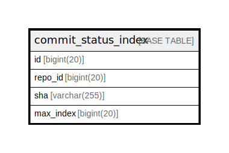

# commit_status_index

## 概要

<details>
<summary><strong>テーブル定義</strong></summary>

```sql
CREATE TABLE `commit_status_index` (
  `id` bigint(20) NOT NULL AUTO_INCREMENT,
  `repo_id` bigint(20) DEFAULT NULL,
  `sha` varchar(255) DEFAULT NULL,
  `max_index` bigint(20) DEFAULT NULL,
  PRIMARY KEY (`id`),
  UNIQUE KEY `UQE_commit_status_index_repo_sha` (`repo_id`,`sha`),
  KEY `IDX_commit_status_index_max_index` (`max_index`)
) ENGINE=InnoDB DEFAULT CHARSET=utf8mb4 ROW_FORMAT=DYNAMIC
```

</details>

## カラム一覧

| 名前        | タイプ          | デフォルト値       | NULL許可   | Extra Definition | 子テーブル      | 親テーブル      | コメント     |
| --------- | ------------ | ------------ | -------- | ---------------- | ---------- | ---------- | -------- |
| id        | bigint(20)   |              | false    | auto_increment   |            |            |          |
| repo_id   | bigint(20)   | NULL         | true     |                  |            |            |          |
| sha       | varchar(255) | NULL         | true     |                  |            |            |          |
| max_index | bigint(20)   | NULL         | true     |                  |            |            |          |

## 制約一覧

| 名前                               | タイプ         | 定義                                                         |
| -------------------------------- | ----------- | ---------------------------------------------------------- |
| PRIMARY                          | PRIMARY KEY | PRIMARY KEY (id)                                           |
| UQE_commit_status_index_repo_sha | UNIQUE      | UNIQUE KEY UQE_commit_status_index_repo_sha (repo_id, sha) |

## INDEX一覧

| 名前                                | 定義                                                                     |
| --------------------------------- | ---------------------------------------------------------------------- |
| IDX_commit_status_index_max_index | KEY IDX_commit_status_index_max_index (max_index) USING BTREE          |
| PRIMARY                           | PRIMARY KEY (id) USING BTREE                                           |
| UQE_commit_status_index_repo_sha  | UNIQUE KEY UQE_commit_status_index_repo_sha (repo_id, sha) USING BTREE |

## ER図



---

> Generated by [tbls](https://github.com/k1LoW/tbls)
