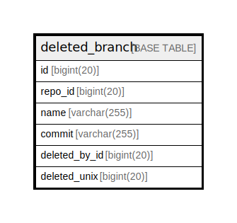

# deleted_branch

## 概要

<details>
<summary><strong>テーブル定義</strong></summary>

```sql
CREATE TABLE `deleted_branch` (
  `id` bigint(20) NOT NULL AUTO_INCREMENT,
  `repo_id` bigint(20) NOT NULL,
  `name` varchar(255) NOT NULL,
  `commit` varchar(255) NOT NULL,
  `deleted_by_id` bigint(20) DEFAULT NULL,
  `deleted_unix` bigint(20) DEFAULT NULL,
  PRIMARY KEY (`id`),
  UNIQUE KEY `UQE_deleted_branch_s` (`repo_id`,`name`,`commit`),
  KEY `IDX_deleted_branch_repo_id` (`repo_id`),
  KEY `IDX_deleted_branch_deleted_by_id` (`deleted_by_id`),
  KEY `IDX_deleted_branch_deleted_unix` (`deleted_unix`)
) ENGINE=InnoDB DEFAULT CHARSET=utf8mb4 ROW_FORMAT=DYNAMIC
```

</details>

## カラム一覧

| 名前            | タイプ          | デフォルト値       | NULL許可   | Extra Definition | 子テーブル      | 親テーブル      | コメント     |
| ------------- | ------------ | ------------ | -------- | ---------------- | ---------- | ---------- | -------- |
| id            | bigint(20)   |              | false    | auto_increment   |            |            |          |
| repo_id       | bigint(20)   |              | false    |                  |            |            |          |
| name          | varchar(255) |              | false    |                  |            |            |          |
| commit        | varchar(255) |              | false    |                  |            |            |          |
| deleted_by_id | bigint(20)   | NULL         | true     |                  |            |            |          |
| deleted_unix  | bigint(20)   | NULL         | true     |                  |            |            |          |

## 制約一覧

| 名前                   | タイプ         | 定義                                                      |
| -------------------- | ----------- | ------------------------------------------------------- |
| PRIMARY              | PRIMARY KEY | PRIMARY KEY (id)                                        |
| UQE_deleted_branch_s | UNIQUE      | UNIQUE KEY UQE_deleted_branch_s (repo_id, name, commit) |

## INDEX一覧

| 名前                               | 定義                                                                  |
| -------------------------------- | ------------------------------------------------------------------- |
| IDX_deleted_branch_deleted_by_id | KEY IDX_deleted_branch_deleted_by_id (deleted_by_id) USING BTREE    |
| IDX_deleted_branch_deleted_unix  | KEY IDX_deleted_branch_deleted_unix (deleted_unix) USING BTREE      |
| IDX_deleted_branch_repo_id       | KEY IDX_deleted_branch_repo_id (repo_id) USING BTREE                |
| PRIMARY                          | PRIMARY KEY (id) USING BTREE                                        |
| UQE_deleted_branch_s             | UNIQUE KEY UQE_deleted_branch_s (repo_id, name, commit) USING BTREE |

## ER図



---

> Generated by [tbls](https://github.com/k1LoW/tbls)
