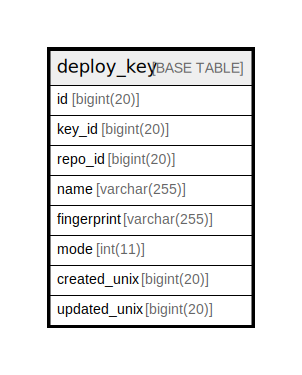

# deploy_key

## 概要

<details>
<summary><strong>テーブル定義</strong></summary>

```sql
CREATE TABLE `deploy_key` (
  `id` bigint(20) NOT NULL AUTO_INCREMENT,
  `key_id` bigint(20) DEFAULT NULL,
  `repo_id` bigint(20) DEFAULT NULL,
  `name` varchar(255) DEFAULT NULL,
  `fingerprint` varchar(255) DEFAULT NULL,
  `mode` int(11) NOT NULL DEFAULT 1,
  `created_unix` bigint(20) DEFAULT NULL,
  `updated_unix` bigint(20) DEFAULT NULL,
  PRIMARY KEY (`id`),
  UNIQUE KEY `UQE_deploy_key_s` (`key_id`,`repo_id`),
  KEY `IDX_deploy_key_key_id` (`key_id`),
  KEY `IDX_deploy_key_repo_id` (`repo_id`)
) ENGINE=InnoDB DEFAULT CHARSET=utf8mb4 ROW_FORMAT=DYNAMIC
```

</details>

## カラム一覧

| 名前           | タイプ          | デフォルト値       | NULL許可   | Extra Definition | 子テーブル      | 親テーブル      | コメント     |
| ------------ | ------------ | ------------ | -------- | ---------------- | ---------- | ---------- | -------- |
| id           | bigint(20)   |              | false    | auto_increment   |            |            |          |
| key_id       | bigint(20)   | NULL         | true     |                  |            |            |          |
| repo_id      | bigint(20)   | NULL         | true     |                  |            |            |          |
| name         | varchar(255) | NULL         | true     |                  |            |            |          |
| fingerprint  | varchar(255) | NULL         | true     |                  |            |            |          |
| mode         | int(11)      | 1            | false    |                  |            |            |          |
| created_unix | bigint(20)   | NULL         | true     |                  |            |            |          |
| updated_unix | bigint(20)   | NULL         | true     |                  |            |            |          |

## 制約一覧

| 名前               | タイプ         | 定義                                            |
| ---------------- | ----------- | --------------------------------------------- |
| PRIMARY          | PRIMARY KEY | PRIMARY KEY (id)                              |
| UQE_deploy_key_s | UNIQUE      | UNIQUE KEY UQE_deploy_key_s (key_id, repo_id) |

## INDEX一覧

| 名前                     | 定義                                                        |
| ---------------------- | --------------------------------------------------------- |
| IDX_deploy_key_key_id  | KEY IDX_deploy_key_key_id (key_id) USING BTREE            |
| IDX_deploy_key_repo_id | KEY IDX_deploy_key_repo_id (repo_id) USING BTREE          |
| PRIMARY                | PRIMARY KEY (id) USING BTREE                              |
| UQE_deploy_key_s       | UNIQUE KEY UQE_deploy_key_s (key_id, repo_id) USING BTREE |

## ER図



---

> Generated by [tbls](https://github.com/k1LoW/tbls)
