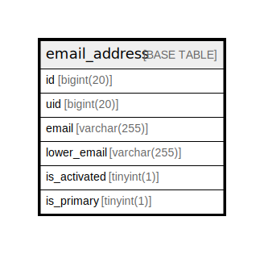

# email_address

## 概要

<details>
<summary><strong>テーブル定義</strong></summary>

```sql
CREATE TABLE `email_address` (
  `id` bigint(20) NOT NULL AUTO_INCREMENT,
  `uid` bigint(20) NOT NULL,
  `email` varchar(255) NOT NULL,
  `lower_email` varchar(255) NOT NULL,
  `is_activated` tinyint(1) DEFAULT NULL,
  `is_primary` tinyint(1) NOT NULL DEFAULT 0,
  PRIMARY KEY (`id`),
  UNIQUE KEY `UQE_email_address_email` (`email`),
  UNIQUE KEY `UQE_email_address_lower_email` (`lower_email`),
  KEY `IDX_email_address_uid` (`uid`)
) ENGINE=InnoDB DEFAULT CHARSET=utf8mb4 ROW_FORMAT=DYNAMIC
```

</details>

## カラム一覧

| 名前           | タイプ          | デフォルト値       | NULL許可   | Extra Definition | 子テーブル      | 親テーブル      | コメント     |
| ------------ | ------------ | ------------ | -------- | ---------------- | ---------- | ---------- | -------- |
| id           | bigint(20)   |              | false    | auto_increment   |            |            |          |
| uid          | bigint(20)   |              | false    |                  |            |            |          |
| email        | varchar(255) |              | false    |                  |            |            |          |
| lower_email  | varchar(255) |              | false    |                  |            |            |          |
| is_activated | tinyint(1)   | NULL         | true     |                  |            |            |          |
| is_primary   | tinyint(1)   | 0            | false    |                  |            |            |          |

## 制約一覧

| 名前                            | タイプ         | 定義                                                     |
| ----------------------------- | ----------- | ------------------------------------------------------ |
| PRIMARY                       | PRIMARY KEY | PRIMARY KEY (id)                                       |
| UQE_email_address_email       | UNIQUE      | UNIQUE KEY UQE_email_address_email (email)             |
| UQE_email_address_lower_email | UNIQUE      | UNIQUE KEY UQE_email_address_lower_email (lower_email) |

## INDEX一覧

| 名前                            | 定義                                                                 |
| ----------------------------- | ------------------------------------------------------------------ |
| IDX_email_address_uid         | KEY IDX_email_address_uid (uid) USING BTREE                        |
| PRIMARY                       | PRIMARY KEY (id) USING BTREE                                       |
| UQE_email_address_email       | UNIQUE KEY UQE_email_address_email (email) USING BTREE             |
| UQE_email_address_lower_email | UNIQUE KEY UQE_email_address_lower_email (lower_email) USING BTREE |

## ER図



---

> Generated by [tbls](https://github.com/k1LoW/tbls)
