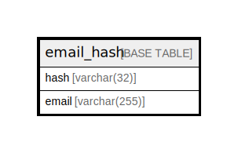

# email_hash

## 概要

<details>
<summary><strong>テーブル定義</strong></summary>

```sql
CREATE TABLE `email_hash` (
  `hash` varchar(32) NOT NULL,
  `email` varchar(255) NOT NULL,
  PRIMARY KEY (`hash`),
  UNIQUE KEY `UQE_email_hash_email` (`email`)
) ENGINE=InnoDB DEFAULT CHARSET=utf8mb4 ROW_FORMAT=DYNAMIC
```

</details>

## カラム一覧

| 名前    | タイプ          | デフォルト値       | NULL許可   | 子テーブル      | 親テーブル      | コメント     |
| ----- | ------------ | ------------ | -------- | ---------- | ---------- | -------- |
| hash  | varchar(32)  |              | false    |            |            |          |
| email | varchar(255) |              | false    |            |            |          |

## 制約一覧

| 名前                   | タイプ         | 定義                                      |
| -------------------- | ----------- | --------------------------------------- |
| PRIMARY              | PRIMARY KEY | PRIMARY KEY (hash)                      |
| UQE_email_hash_email | UNIQUE      | UNIQUE KEY UQE_email_hash_email (email) |

## INDEX一覧

| 名前                   | 定義                                                  |
| -------------------- | --------------------------------------------------- |
| PRIMARY              | PRIMARY KEY (hash) USING BTREE                      |
| UQE_email_hash_email | UNIQUE KEY UQE_email_hash_email (email) USING BTREE |

## ER図



---

> Generated by [tbls](https://github.com/k1LoW/tbls)
