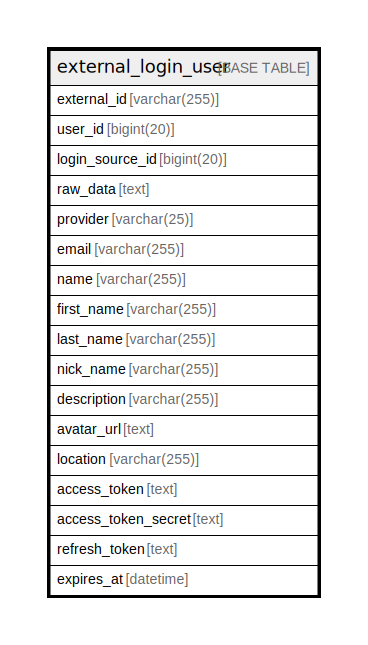

# external_login_user

## 概要

<details>
<summary><strong>テーブル定義</strong></summary>

```sql
CREATE TABLE `external_login_user` (
  `external_id` varchar(255) NOT NULL,
  `user_id` bigint(20) NOT NULL,
  `login_source_id` bigint(20) NOT NULL,
  `raw_data` text DEFAULT NULL,
  `provider` varchar(25) DEFAULT NULL,
  `email` varchar(255) DEFAULT NULL,
  `name` varchar(255) DEFAULT NULL,
  `first_name` varchar(255) DEFAULT NULL,
  `last_name` varchar(255) DEFAULT NULL,
  `nick_name` varchar(255) DEFAULT NULL,
  `description` varchar(255) DEFAULT NULL,
  `avatar_url` text DEFAULT NULL,
  `location` varchar(255) DEFAULT NULL,
  `access_token` text DEFAULT NULL,
  `access_token_secret` text DEFAULT NULL,
  `refresh_token` text DEFAULT NULL,
  `expires_at` datetime DEFAULT NULL,
  PRIMARY KEY (`external_id`,`login_source_id`),
  KEY `IDX_external_login_user_user_id` (`user_id`),
  KEY `IDX_external_login_user_provider` (`provider`)
) ENGINE=InnoDB DEFAULT CHARSET=utf8mb4 ROW_FORMAT=DYNAMIC
```

</details>

## カラム一覧

| 名前                  | タイプ          | デフォルト値       | NULL許可   | 子テーブル      | 親テーブル      | コメント     |
| ------------------- | ------------ | ------------ | -------- | ---------- | ---------- | -------- |
| external_id         | varchar(255) |              | false    |            |            |          |
| user_id             | bigint(20)   |              | false    |            |            |          |
| login_source_id     | bigint(20)   |              | false    |            |            |          |
| raw_data            | text         | NULL         | true     |            |            |          |
| provider            | varchar(25)  | NULL         | true     |            |            |          |
| email               | varchar(255) | NULL         | true     |            |            |          |
| name                | varchar(255) | NULL         | true     |            |            |          |
| first_name          | varchar(255) | NULL         | true     |            |            |          |
| last_name           | varchar(255) | NULL         | true     |            |            |          |
| nick_name           | varchar(255) | NULL         | true     |            |            |          |
| description         | varchar(255) | NULL         | true     |            |            |          |
| avatar_url          | text         | NULL         | true     |            |            |          |
| location            | varchar(255) | NULL         | true     |            |            |          |
| access_token        | text         | NULL         | true     |            |            |          |
| access_token_secret | text         | NULL         | true     |            |            |          |
| refresh_token       | text         | NULL         | true     |            |            |          |
| expires_at          | datetime     | NULL         | true     |            |            |          |

## 制約一覧

| 名前      | タイプ         | 定義                                         |
| ------- | ----------- | ------------------------------------------ |
| PRIMARY | PRIMARY KEY | PRIMARY KEY (external_id, login_source_id) |

## INDEX一覧

| 名前                               | 定義                                                          |
| -------------------------------- | ----------------------------------------------------------- |
| IDX_external_login_user_provider | KEY IDX_external_login_user_provider (provider) USING BTREE |
| IDX_external_login_user_user_id  | KEY IDX_external_login_user_user_id (user_id) USING BTREE   |
| PRIMARY                          | PRIMARY KEY (external_id, login_source_id) USING BTREE      |

## ER図



---

> Generated by [tbls](https://github.com/k1LoW/tbls)
