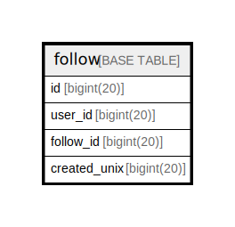

# follow

## 概要

<details>
<summary><strong>テーブル定義</strong></summary>

```sql
CREATE TABLE `follow` (
  `id` bigint(20) NOT NULL AUTO_INCREMENT,
  `user_id` bigint(20) DEFAULT NULL,
  `follow_id` bigint(20) DEFAULT NULL,
  `created_unix` bigint(20) DEFAULT NULL,
  PRIMARY KEY (`id`),
  UNIQUE KEY `UQE_follow_follow` (`user_id`,`follow_id`),
  KEY `IDX_follow_created_unix` (`created_unix`)
) ENGINE=InnoDB DEFAULT CHARSET=utf8mb4 ROW_FORMAT=DYNAMIC
```

</details>

## カラム一覧

| 名前           | タイプ        | デフォルト値       | NULL許可   | Extra Definition | 子テーブル      | 親テーブル      | コメント     |
| ------------ | ---------- | ------------ | -------- | ---------------- | ---------- | ---------- | -------- |
| id           | bigint(20) |              | false    | auto_increment   |            |            |          |
| user_id      | bigint(20) | NULL         | true     |                  |            |            |          |
| follow_id    | bigint(20) | NULL         | true     |                  |            |            |          |
| created_unix | bigint(20) | NULL         | true     |                  |            |            |          |

## 制約一覧

| 名前                | タイプ         | 定義                                                |
| ----------------- | ----------- | ------------------------------------------------- |
| PRIMARY           | PRIMARY KEY | PRIMARY KEY (id)                                  |
| UQE_follow_follow | UNIQUE      | UNIQUE KEY UQE_follow_follow (user_id, follow_id) |

## INDEX一覧

| 名前                      | 定義                                                            |
| ----------------------- | ------------------------------------------------------------- |
| IDX_follow_created_unix | KEY IDX_follow_created_unix (created_unix) USING BTREE        |
| PRIMARY                 | PRIMARY KEY (id) USING BTREE                                  |
| UQE_follow_follow       | UNIQUE KEY UQE_follow_follow (user_id, follow_id) USING BTREE |

## ER図



---

> Generated by [tbls](https://github.com/k1LoW/tbls)
