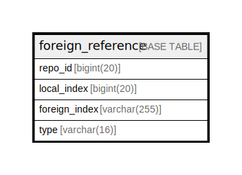

# foreign_reference

## 概要

<details>
<summary><strong>テーブル定義</strong></summary>

```sql
CREATE TABLE `foreign_reference` (
  `repo_id` bigint(20) DEFAULT NULL,
  `local_index` bigint(20) DEFAULT NULL,
  `foreign_index` varchar(255) DEFAULT NULL,
  `type` varchar(16) DEFAULT NULL,
  UNIQUE KEY `UQE_foreign_reference_repo_foreign_type` (`repo_id`,`foreign_index`,`type`),
  KEY `IDX_foreign_reference_repo_local` (`repo_id`,`local_index`),
  KEY `IDX_foreign_reference_foreign_index` (`foreign_index`),
  KEY `IDX_foreign_reference_type` (`type`)
) ENGINE=InnoDB DEFAULT CHARSET=utf8mb4 ROW_FORMAT=DYNAMIC
```

</details>

## カラム一覧

| 名前            | タイプ          | デフォルト値       | NULL許可   | 子テーブル      | 親テーブル      | コメント     |
| ------------- | ------------ | ------------ | -------- | ---------- | ---------- | -------- |
| repo_id       | bigint(20)   | NULL         | true     |            |            |          |
| local_index   | bigint(20)   | NULL         | true     |            |            |          |
| foreign_index | varchar(255) | NULL         | true     |            |            |          |
| type          | varchar(16)  | NULL         | true     |            |            |          |

## 制約一覧

| 名前                                      | タイプ    | 定義                                                                                |
| --------------------------------------- | ------ | --------------------------------------------------------------------------------- |
| UQE_foreign_reference_repo_foreign_type | UNIQUE | UNIQUE KEY UQE_foreign_reference_repo_foreign_type (repo_id, foreign_index, type) |

## INDEX一覧

| 名前                                      | 定義                                                                                            |
| --------------------------------------- | --------------------------------------------------------------------------------------------- |
| IDX_foreign_reference_foreign_index     | KEY IDX_foreign_reference_foreign_index (foreign_index) USING BTREE                           |
| IDX_foreign_reference_repo_local        | KEY IDX_foreign_reference_repo_local (repo_id, local_index) USING BTREE                       |
| IDX_foreign_reference_type              | KEY IDX_foreign_reference_type (type) USING BTREE                                             |
| UQE_foreign_reference_repo_foreign_type | UNIQUE KEY UQE_foreign_reference_repo_foreign_type (repo_id, foreign_index, type) USING BTREE |

## ER図



---

> Generated by [tbls](https://github.com/k1LoW/tbls)
