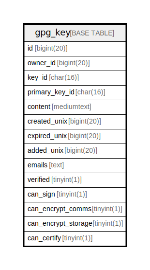

# gpg_key

## 概要

<details>
<summary><strong>テーブル定義</strong></summary>

```sql
CREATE TABLE `gpg_key` (
  `id` bigint(20) NOT NULL AUTO_INCREMENT,
  `owner_id` bigint(20) NOT NULL,
  `key_id` char(16) NOT NULL,
  `primary_key_id` char(16) DEFAULT NULL,
  `content` mediumtext NOT NULL,
  `created_unix` bigint(20) DEFAULT NULL,
  `expired_unix` bigint(20) DEFAULT NULL,
  `added_unix` bigint(20) DEFAULT NULL,
  `emails` text DEFAULT NULL,
  `verified` tinyint(1) NOT NULL DEFAULT 0,
  `can_sign` tinyint(1) DEFAULT NULL,
  `can_encrypt_comms` tinyint(1) DEFAULT NULL,
  `can_encrypt_storage` tinyint(1) DEFAULT NULL,
  `can_certify` tinyint(1) DEFAULT NULL,
  PRIMARY KEY (`id`),
  KEY `IDX_gpg_key_owner_id` (`owner_id`),
  KEY `IDX_gpg_key_key_id` (`key_id`)
) ENGINE=InnoDB DEFAULT CHARSET=utf8mb4 ROW_FORMAT=DYNAMIC
```

</details>

## カラム一覧

| 名前                  | タイプ        | デフォルト値       | NULL許可   | Extra Definition | 子テーブル      | 親テーブル      | コメント     |
| ------------------- | ---------- | ------------ | -------- | ---------------- | ---------- | ---------- | -------- |
| id                  | bigint(20) |              | false    | auto_increment   |            |            |          |
| owner_id            | bigint(20) |              | false    |                  |            |            |          |
| key_id              | char(16)   |              | false    |                  |            |            |          |
| primary_key_id      | char(16)   | NULL         | true     |                  |            |            |          |
| content             | mediumtext |              | false    |                  |            |            |          |
| created_unix        | bigint(20) | NULL         | true     |                  |            |            |          |
| expired_unix        | bigint(20) | NULL         | true     |                  |            |            |          |
| added_unix          | bigint(20) | NULL         | true     |                  |            |            |          |
| emails              | text       | NULL         | true     |                  |            |            |          |
| verified            | tinyint(1) | 0            | false    |                  |            |            |          |
| can_sign            | tinyint(1) | NULL         | true     |                  |            |            |          |
| can_encrypt_comms   | tinyint(1) | NULL         | true     |                  |            |            |          |
| can_encrypt_storage | tinyint(1) | NULL         | true     |                  |            |            |          |
| can_certify         | tinyint(1) | NULL         | true     |                  |            |            |          |

## 制約一覧

| 名前      | タイプ         | 定義               |
| ------- | ----------- | ---------------- |
| PRIMARY | PRIMARY KEY | PRIMARY KEY (id) |

## INDEX一覧

| 名前                   | 定義                                              |
| -------------------- | ----------------------------------------------- |
| IDX_gpg_key_key_id   | KEY IDX_gpg_key_key_id (key_id) USING BTREE     |
| IDX_gpg_key_owner_id | KEY IDX_gpg_key_owner_id (owner_id) USING BTREE |
| PRIMARY              | PRIMARY KEY (id) USING BTREE                    |

## ER図



---

> Generated by [tbls](https://github.com/k1LoW/tbls)
