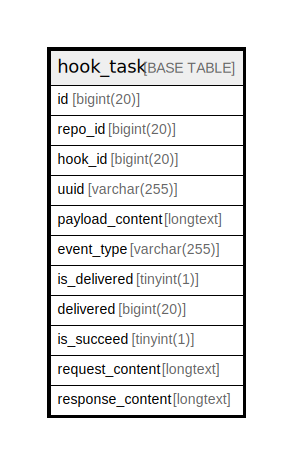

# hook_task

## 概要

<details>
<summary><strong>テーブル定義</strong></summary>

```sql
CREATE TABLE `hook_task` (
  `id` bigint(20) NOT NULL AUTO_INCREMENT,
  `repo_id` bigint(20) DEFAULT NULL,
  `hook_id` bigint(20) DEFAULT NULL,
  `uuid` varchar(255) DEFAULT NULL,
  `payload_content` longtext DEFAULT NULL,
  `event_type` varchar(255) DEFAULT NULL,
  `is_delivered` tinyint(1) DEFAULT NULL,
  `delivered` bigint(20) DEFAULT NULL,
  `is_succeed` tinyint(1) DEFAULT NULL,
  `request_content` longtext DEFAULT NULL,
  `response_content` longtext DEFAULT NULL,
  PRIMARY KEY (`id`),
  KEY `IDX_hook_task_repo_id` (`repo_id`)
) ENGINE=InnoDB DEFAULT CHARSET=utf8mb4 ROW_FORMAT=DYNAMIC
```

</details>

## カラム一覧

| 名前               | タイプ          | デフォルト値       | NULL許可   | Extra Definition | 子テーブル      | 親テーブル      | コメント     |
| ---------------- | ------------ | ------------ | -------- | ---------------- | ---------- | ---------- | -------- |
| id               | bigint(20)   |              | false    | auto_increment   |            |            |          |
| repo_id          | bigint(20)   | NULL         | true     |                  |            |            |          |
| hook_id          | bigint(20)   | NULL         | true     |                  |            |            |          |
| uuid             | varchar(255) | NULL         | true     |                  |            |            |          |
| payload_content  | longtext     | NULL         | true     |                  |            |            |          |
| event_type       | varchar(255) | NULL         | true     |                  |            |            |          |
| is_delivered     | tinyint(1)   | NULL         | true     |                  |            |            |          |
| delivered        | bigint(20)   | NULL         | true     |                  |            |            |          |
| is_succeed       | tinyint(1)   | NULL         | true     |                  |            |            |          |
| request_content  | longtext     | NULL         | true     |                  |            |            |          |
| response_content | longtext     | NULL         | true     |                  |            |            |          |

## 制約一覧

| 名前      | タイプ         | 定義               |
| ------- | ----------- | ---------------- |
| PRIMARY | PRIMARY KEY | PRIMARY KEY (id) |

## INDEX一覧

| 名前                    | 定義                                              |
| --------------------- | ----------------------------------------------- |
| IDX_hook_task_repo_id | KEY IDX_hook_task_repo_id (repo_id) USING BTREE |
| PRIMARY               | PRIMARY KEY (id) USING BTREE                    |

## ER図



---

> Generated by [tbls](https://github.com/k1LoW/tbls)
