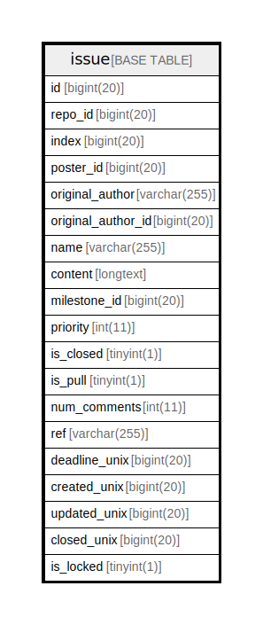

# issue

## 概要

<details>
<summary><strong>テーブル定義</strong></summary>

```sql
CREATE TABLE `issue` (
  `id` bigint(20) NOT NULL AUTO_INCREMENT,
  `repo_id` bigint(20) DEFAULT NULL,
  `index` bigint(20) DEFAULT NULL,
  `poster_id` bigint(20) DEFAULT NULL,
  `original_author` varchar(255) DEFAULT NULL,
  `original_author_id` bigint(20) DEFAULT NULL,
  `name` varchar(255) DEFAULT NULL,
  `content` longtext DEFAULT NULL,
  `milestone_id` bigint(20) DEFAULT NULL,
  `priority` int(11) DEFAULT NULL,
  `is_closed` tinyint(1) DEFAULT NULL,
  `is_pull` tinyint(1) DEFAULT NULL,
  `num_comments` int(11) DEFAULT NULL,
  `ref` varchar(255) DEFAULT NULL,
  `deadline_unix` bigint(20) DEFAULT NULL,
  `created_unix` bigint(20) DEFAULT NULL,
  `updated_unix` bigint(20) DEFAULT NULL,
  `closed_unix` bigint(20) DEFAULT NULL,
  `is_locked` tinyint(1) NOT NULL DEFAULT 0,
  PRIMARY KEY (`id`),
  UNIQUE KEY `UQE_issue_repo_index` (`repo_id`,`index`),
  KEY `IDX_issue_closed_unix` (`closed_unix`),
  KEY `IDX_issue_poster_id` (`poster_id`),
  KEY `IDX_issue_is_closed` (`is_closed`),
  KEY `IDX_issue_is_pull` (`is_pull`),
  KEY `IDX_issue_deadline_unix` (`deadline_unix`),
  KEY `IDX_issue_created_unix` (`created_unix`),
  KEY `IDX_issue_updated_unix` (`updated_unix`),
  KEY `IDX_issue_repo_id` (`repo_id`),
  KEY `IDX_issue_original_author_id` (`original_author_id`),
  KEY `IDX_issue_milestone_id` (`milestone_id`)
) ENGINE=InnoDB DEFAULT CHARSET=utf8mb4 ROW_FORMAT=DYNAMIC
```

</details>

## カラム一覧

| 名前                 | タイプ          | デフォルト値       | NULL許可   | Extra Definition | 子テーブル      | 親テーブル      | コメント     |
| ------------------ | ------------ | ------------ | -------- | ---------------- | ---------- | ---------- | -------- |
| id                 | bigint(20)   |              | false    | auto_increment   |            |            |          |
| repo_id            | bigint(20)   | NULL         | true     |                  |            |            |          |
| index              | bigint(20)   | NULL         | true     |                  |            |            |          |
| poster_id          | bigint(20)   | NULL         | true     |                  |            |            |          |
| original_author    | varchar(255) | NULL         | true     |                  |            |            |          |
| original_author_id | bigint(20)   | NULL         | true     |                  |            |            |          |
| name               | varchar(255) | NULL         | true     |                  |            |            |          |
| content            | longtext     | NULL         | true     |                  |            |            |          |
| milestone_id       | bigint(20)   | NULL         | true     |                  |            |            |          |
| priority           | int(11)      | NULL         | true     |                  |            |            |          |
| is_closed          | tinyint(1)   | NULL         | true     |                  |            |            |          |
| is_pull            | tinyint(1)   | NULL         | true     |                  |            |            |          |
| num_comments       | int(11)      | NULL         | true     |                  |            |            |          |
| ref                | varchar(255) | NULL         | true     |                  |            |            |          |
| deadline_unix      | bigint(20)   | NULL         | true     |                  |            |            |          |
| created_unix       | bigint(20)   | NULL         | true     |                  |            |            |          |
| updated_unix       | bigint(20)   | NULL         | true     |                  |            |            |          |
| closed_unix        | bigint(20)   | NULL         | true     |                  |            |            |          |
| is_locked          | tinyint(1)   | 0            | false    |                  |            |            |          |

## 制約一覧

| 名前                   | タイプ         | 定義                                               |
| -------------------- | ----------- | ------------------------------------------------ |
| PRIMARY              | PRIMARY KEY | PRIMARY KEY (id)                                 |
| UQE_issue_repo_index | UNIQUE      | UNIQUE KEY UQE_issue_repo_index (repo_id, index) |

## INDEX一覧

| 名前                           | 定義                                                                |
| ---------------------------- | ----------------------------------------------------------------- |
| IDX_issue_closed_unix        | KEY IDX_issue_closed_unix (closed_unix) USING BTREE               |
| IDX_issue_created_unix       | KEY IDX_issue_created_unix (created_unix) USING BTREE             |
| IDX_issue_deadline_unix      | KEY IDX_issue_deadline_unix (deadline_unix) USING BTREE           |
| IDX_issue_is_closed          | KEY IDX_issue_is_closed (is_closed) USING BTREE                   |
| IDX_issue_is_pull            | KEY IDX_issue_is_pull (is_pull) USING BTREE                       |
| IDX_issue_milestone_id       | KEY IDX_issue_milestone_id (milestone_id) USING BTREE             |
| IDX_issue_original_author_id | KEY IDX_issue_original_author_id (original_author_id) USING BTREE |
| IDX_issue_poster_id          | KEY IDX_issue_poster_id (poster_id) USING BTREE                   |
| IDX_issue_repo_id            | KEY IDX_issue_repo_id (repo_id) USING BTREE                       |
| IDX_issue_updated_unix       | KEY IDX_issue_updated_unix (updated_unix) USING BTREE             |
| PRIMARY                      | PRIMARY KEY (id) USING BTREE                                      |
| UQE_issue_repo_index         | UNIQUE KEY UQE_issue_repo_index (repo_id, index) USING BTREE      |

## ER図



---

> Generated by [tbls](https://github.com/k1LoW/tbls)
