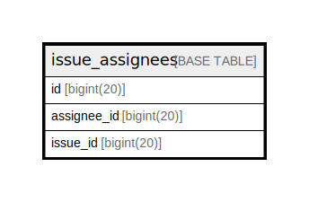

# issue_assignees

## 概要

<details>
<summary><strong>テーブル定義</strong></summary>

```sql
CREATE TABLE `issue_assignees` (
  `id` bigint(20) NOT NULL AUTO_INCREMENT,
  `assignee_id` bigint(20) DEFAULT NULL,
  `issue_id` bigint(20) DEFAULT NULL,
  PRIMARY KEY (`id`),
  KEY `IDX_issue_assignees_assignee_id` (`assignee_id`),
  KEY `IDX_issue_assignees_issue_id` (`issue_id`)
) ENGINE=InnoDB DEFAULT CHARSET=utf8mb4 ROW_FORMAT=DYNAMIC
```

</details>

## カラム一覧

| 名前          | タイプ        | デフォルト値       | NULL許可   | Extra Definition | 子テーブル      | 親テーブル      | コメント     |
| ----------- | ---------- | ------------ | -------- | ---------------- | ---------- | ---------- | -------- |
| id          | bigint(20) |              | false    | auto_increment   |            |            |          |
| assignee_id | bigint(20) | NULL         | true     |                  |            |            |          |
| issue_id    | bigint(20) | NULL         | true     |                  |            |            |          |

## 制約一覧

| 名前      | タイプ         | 定義               |
| ------- | ----------- | ---------------- |
| PRIMARY | PRIMARY KEY | PRIMARY KEY (id) |

## INDEX一覧

| 名前                              | 定義                                                            |
| ------------------------------- | ------------------------------------------------------------- |
| IDX_issue_assignees_assignee_id | KEY IDX_issue_assignees_assignee_id (assignee_id) USING BTREE |
| IDX_issue_assignees_issue_id    | KEY IDX_issue_assignees_issue_id (issue_id) USING BTREE       |
| PRIMARY                         | PRIMARY KEY (id) USING BTREE                                  |

## ER図



---

> Generated by [tbls](https://github.com/k1LoW/tbls)
