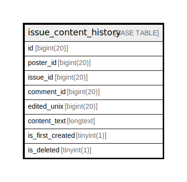

# issue_content_history

## 概要

<details>
<summary><strong>テーブル定義</strong></summary>

```sql
CREATE TABLE `issue_content_history` (
  `id` bigint(20) NOT NULL AUTO_INCREMENT,
  `poster_id` bigint(20) DEFAULT NULL,
  `issue_id` bigint(20) DEFAULT NULL,
  `comment_id` bigint(20) DEFAULT NULL,
  `edited_unix` bigint(20) DEFAULT NULL,
  `content_text` longtext DEFAULT NULL,
  `is_first_created` tinyint(1) DEFAULT NULL,
  `is_deleted` tinyint(1) DEFAULT NULL,
  PRIMARY KEY (`id`),
  KEY `IDX_issue_content_history_issue_id` (`issue_id`),
  KEY `IDX_issue_content_history_comment_id` (`comment_id`),
  KEY `IDX_issue_content_history_edited_unix` (`edited_unix`)
) ENGINE=InnoDB DEFAULT CHARSET=utf8mb4 ROW_FORMAT=DYNAMIC
```

</details>

## カラム一覧

| 名前               | タイプ        | デフォルト値       | NULL許可   | Extra Definition | 子テーブル      | 親テーブル      | コメント     |
| ---------------- | ---------- | ------------ | -------- | ---------------- | ---------- | ---------- | -------- |
| id               | bigint(20) |              | false    | auto_increment   |            |            |          |
| poster_id        | bigint(20) | NULL         | true     |                  |            |            |          |
| issue_id         | bigint(20) | NULL         | true     |                  |            |            |          |
| comment_id       | bigint(20) | NULL         | true     |                  |            |            |          |
| edited_unix      | bigint(20) | NULL         | true     |                  |            |            |          |
| content_text     | longtext   | NULL         | true     |                  |            |            |          |
| is_first_created | tinyint(1) | NULL         | true     |                  |            |            |          |
| is_deleted       | tinyint(1) | NULL         | true     |                  |            |            |          |

## 制約一覧

| 名前      | タイプ         | 定義               |
| ------- | ----------- | ---------------- |
| PRIMARY | PRIMARY KEY | PRIMARY KEY (id) |

## INDEX一覧

| 名前                                    | 定義                                                                  |
| ------------------------------------- | ------------------------------------------------------------------- |
| IDX_issue_content_history_comment_id  | KEY IDX_issue_content_history_comment_id (comment_id) USING BTREE   |
| IDX_issue_content_history_edited_unix | KEY IDX_issue_content_history_edited_unix (edited_unix) USING BTREE |
| IDX_issue_content_history_issue_id    | KEY IDX_issue_content_history_issue_id (issue_id) USING BTREE       |
| PRIMARY                               | PRIMARY KEY (id) USING BTREE                                        |

## ER図



---

> Generated by [tbls](https://github.com/k1LoW/tbls)
