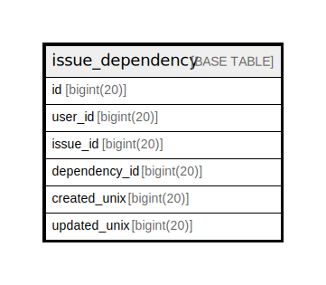

# issue_dependency

## 概要

<details>
<summary><strong>テーブル定義</strong></summary>

```sql
CREATE TABLE `issue_dependency` (
  `id` bigint(20) NOT NULL AUTO_INCREMENT,
  `user_id` bigint(20) NOT NULL,
  `issue_id` bigint(20) NOT NULL,
  `dependency_id` bigint(20) NOT NULL,
  `created_unix` bigint(20) DEFAULT NULL,
  `updated_unix` bigint(20) DEFAULT NULL,
  PRIMARY KEY (`id`),
  UNIQUE KEY `UQE_issue_dependency_issue_dependency` (`issue_id`,`dependency_id`)
) ENGINE=InnoDB DEFAULT CHARSET=utf8mb4 ROW_FORMAT=DYNAMIC
```

</details>

## カラム一覧

| 名前            | タイプ        | デフォルト値       | NULL許可   | Extra Definition | 子テーブル      | 親テーブル      | コメント     |
| ------------- | ---------- | ------------ | -------- | ---------------- | ---------- | ---------- | -------- |
| id            | bigint(20) |              | false    | auto_increment   |            |            |          |
| user_id       | bigint(20) |              | false    |                  |            |            |          |
| issue_id      | bigint(20) |              | false    |                  |            |            |          |
| dependency_id | bigint(20) |              | false    |                  |            |            |          |
| created_unix  | bigint(20) | NULL         | true     |                  |            |            |          |
| updated_unix  | bigint(20) | NULL         | true     |                  |            |            |          |

## 制約一覧

| 名前                                    | タイプ         | 定義                                                                         |
| ------------------------------------- | ----------- | -------------------------------------------------------------------------- |
| PRIMARY                               | PRIMARY KEY | PRIMARY KEY (id)                                                           |
| UQE_issue_dependency_issue_dependency | UNIQUE      | UNIQUE KEY UQE_issue_dependency_issue_dependency (issue_id, dependency_id) |

## INDEX一覧

| 名前                                    | 定義                                                                                     |
| ------------------------------------- | -------------------------------------------------------------------------------------- |
| PRIMARY                               | PRIMARY KEY (id) USING BTREE                                                           |
| UQE_issue_dependency_issue_dependency | UNIQUE KEY UQE_issue_dependency_issue_dependency (issue_id, dependency_id) USING BTREE |

## ER図



---

> Generated by [tbls](https://github.com/k1LoW/tbls)
