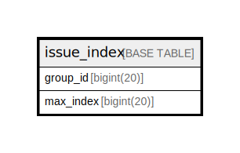

# issue_index

## 概要

<details>
<summary><strong>テーブル定義</strong></summary>

```sql
CREATE TABLE `issue_index` (
  `group_id` bigint(20) NOT NULL,
  `max_index` bigint(20) DEFAULT NULL,
  PRIMARY KEY (`group_id`),
  KEY `IDX_issue_index_max_index` (`max_index`)
) ENGINE=InnoDB DEFAULT CHARSET=utf8mb4 ROW_FORMAT=DYNAMIC
```

</details>

## カラム一覧

| 名前        | タイプ        | デフォルト値       | NULL許可   | 子テーブル      | 親テーブル      | コメント     |
| --------- | ---------- | ------------ | -------- | ---------- | ---------- | -------- |
| group_id  | bigint(20) |              | false    |            |            |          |
| max_index | bigint(20) | NULL         | true     |            |            |          |

## 制約一覧

| 名前      | タイプ         | 定義                     |
| ------- | ----------- | ---------------------- |
| PRIMARY | PRIMARY KEY | PRIMARY KEY (group_id) |

## INDEX一覧

| 名前                        | 定義                                                    |
| ------------------------- | ----------------------------------------------------- |
| IDX_issue_index_max_index | KEY IDX_issue_index_max_index (max_index) USING BTREE |
| PRIMARY                   | PRIMARY KEY (group_id) USING BTREE                    |

## ER図



---

> Generated by [tbls](https://github.com/k1LoW/tbls)
