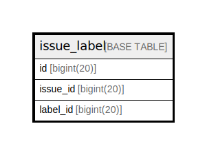

# issue_label

## 概要

<details>
<summary><strong>テーブル定義</strong></summary>

```sql
CREATE TABLE `issue_label` (
  `id` bigint(20) NOT NULL AUTO_INCREMENT,
  `issue_id` bigint(20) DEFAULT NULL,
  `label_id` bigint(20) DEFAULT NULL,
  PRIMARY KEY (`id`),
  UNIQUE KEY `UQE_issue_label_s` (`issue_id`,`label_id`)
) ENGINE=InnoDB DEFAULT CHARSET=utf8mb4 ROW_FORMAT=DYNAMIC
```

</details>

## カラム一覧

| 名前       | タイプ        | デフォルト値       | NULL許可   | Extra Definition | 子テーブル      | 親テーブル      | コメント     |
| -------- | ---------- | ------------ | -------- | ---------------- | ---------- | ---------- | -------- |
| id       | bigint(20) |              | false    | auto_increment   |            |            |          |
| issue_id | bigint(20) | NULL         | true     |                  |            |            |          |
| label_id | bigint(20) | NULL         | true     |                  |            |            |          |

## 制約一覧

| 名前                | タイプ         | 定義                                                |
| ----------------- | ----------- | ------------------------------------------------- |
| PRIMARY           | PRIMARY KEY | PRIMARY KEY (id)                                  |
| UQE_issue_label_s | UNIQUE      | UNIQUE KEY UQE_issue_label_s (issue_id, label_id) |

## INDEX一覧

| 名前                | 定義                                                            |
| ----------------- | ------------------------------------------------------------- |
| PRIMARY           | PRIMARY KEY (id) USING BTREE                                  |
| UQE_issue_label_s | UNIQUE KEY UQE_issue_label_s (issue_id, label_id) USING BTREE |

## ER図



---

> Generated by [tbls](https://github.com/k1LoW/tbls)
