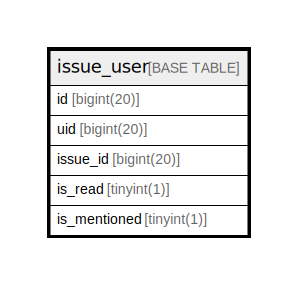

# issue_user

## 概要

<details>
<summary><strong>テーブル定義</strong></summary>

```sql
CREATE TABLE `issue_user` (
  `id` bigint(20) NOT NULL AUTO_INCREMENT,
  `uid` bigint(20) DEFAULT NULL,
  `issue_id` bigint(20) DEFAULT NULL,
  `is_read` tinyint(1) DEFAULT NULL,
  `is_mentioned` tinyint(1) DEFAULT NULL,
  PRIMARY KEY (`id`),
  KEY `IDX_issue_user_uid` (`uid`)
) ENGINE=InnoDB DEFAULT CHARSET=utf8mb4 ROW_FORMAT=DYNAMIC
```

</details>

## カラム一覧

| 名前           | タイプ        | デフォルト値       | NULL許可   | Extra Definition | 子テーブル      | 親テーブル      | コメント     |
| ------------ | ---------- | ------------ | -------- | ---------------- | ---------- | ---------- | -------- |
| id           | bigint(20) |              | false    | auto_increment   |            |            |          |
| uid          | bigint(20) | NULL         | true     |                  |            |            |          |
| issue_id     | bigint(20) | NULL         | true     |                  |            |            |          |
| is_read      | tinyint(1) | NULL         | true     |                  |            |            |          |
| is_mentioned | tinyint(1) | NULL         | true     |                  |            |            |          |

## 制約一覧

| 名前      | タイプ         | 定義               |
| ------- | ----------- | ---------------- |
| PRIMARY | PRIMARY KEY | PRIMARY KEY (id) |

## INDEX一覧

| 名前                 | 定義                                       |
| ------------------ | ---------------------------------------- |
| IDX_issue_user_uid | KEY IDX_issue_user_uid (uid) USING BTREE |
| PRIMARY            | PRIMARY KEY (id) USING BTREE             |

## ER図



---

> Generated by [tbls](https://github.com/k1LoW/tbls)
