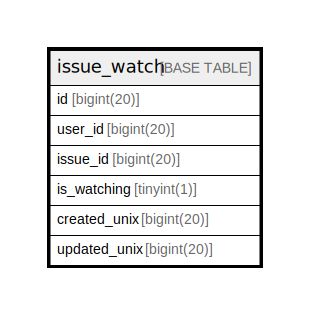

# issue_watch

## 概要

<details>
<summary><strong>テーブル定義</strong></summary>

```sql
CREATE TABLE `issue_watch` (
  `id` bigint(20) NOT NULL AUTO_INCREMENT,
  `user_id` bigint(20) NOT NULL,
  `issue_id` bigint(20) NOT NULL,
  `is_watching` tinyint(1) NOT NULL,
  `created_unix` bigint(20) NOT NULL,
  `updated_unix` bigint(20) NOT NULL,
  PRIMARY KEY (`id`),
  UNIQUE KEY `UQE_issue_watch_watch` (`user_id`,`issue_id`)
) ENGINE=InnoDB DEFAULT CHARSET=utf8mb4 ROW_FORMAT=DYNAMIC
```

</details>

## カラム一覧

| 名前           | タイプ        | デフォルト値       | NULL許可   | Extra Definition | 子テーブル      | 親テーブル      | コメント     |
| ------------ | ---------- | ------------ | -------- | ---------------- | ---------- | ---------- | -------- |
| id           | bigint(20) |              | false    | auto_increment   |            |            |          |
| user_id      | bigint(20) |              | false    |                  |            |            |          |
| issue_id     | bigint(20) |              | false    |                  |            |            |          |
| is_watching  | tinyint(1) |              | false    |                  |            |            |          |
| created_unix | bigint(20) |              | false    |                  |            |            |          |
| updated_unix | bigint(20) |              | false    |                  |            |            |          |

## 制約一覧

| 名前                    | タイプ         | 定義                                                   |
| --------------------- | ----------- | ---------------------------------------------------- |
| PRIMARY               | PRIMARY KEY | PRIMARY KEY (id)                                     |
| UQE_issue_watch_watch | UNIQUE      | UNIQUE KEY UQE_issue_watch_watch (user_id, issue_id) |

## INDEX一覧

| 名前                    | 定義                                                               |
| --------------------- | ---------------------------------------------------------------- |
| PRIMARY               | PRIMARY KEY (id) USING BTREE                                     |
| UQE_issue_watch_watch | UNIQUE KEY UQE_issue_watch_watch (user_id, issue_id) USING BTREE |

## ER図



---

> Generated by [tbls](https://github.com/k1LoW/tbls)
