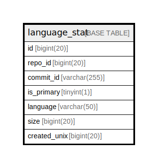

# language_stat

## 概要

<details>
<summary><strong>テーブル定義</strong></summary>

```sql
CREATE TABLE `language_stat` (
  `id` bigint(20) NOT NULL AUTO_INCREMENT,
  `repo_id` bigint(20) NOT NULL,
  `commit_id` varchar(255) DEFAULT NULL,
  `is_primary` tinyint(1) DEFAULT NULL,
  `language` varchar(50) NOT NULL,
  `size` bigint(20) NOT NULL DEFAULT 0,
  `created_unix` bigint(20) DEFAULT NULL,
  PRIMARY KEY (`id`),
  UNIQUE KEY `UQE_language_stat_s` (`repo_id`,`language`),
  KEY `IDX_language_stat_repo_id` (`repo_id`),
  KEY `IDX_language_stat_language` (`language`),
  KEY `IDX_language_stat_created_unix` (`created_unix`)
) ENGINE=InnoDB DEFAULT CHARSET=utf8mb4 ROW_FORMAT=DYNAMIC
```

</details>

## カラム一覧

| 名前           | タイプ          | デフォルト値       | NULL許可   | Extra Definition | 子テーブル      | 親テーブル      | コメント     |
| ------------ | ------------ | ------------ | -------- | ---------------- | ---------- | ---------- | -------- |
| id           | bigint(20)   |              | false    | auto_increment   |            |            |          |
| repo_id      | bigint(20)   |              | false    |                  |            |            |          |
| commit_id    | varchar(255) | NULL         | true     |                  |            |            |          |
| is_primary   | tinyint(1)   | NULL         | true     |                  |            |            |          |
| language     | varchar(50)  |              | false    |                  |            |            |          |
| size         | bigint(20)   | 0            | false    |                  |            |            |          |
| created_unix | bigint(20)   | NULL         | true     |                  |            |            |          |

## 制約一覧

| 名前                  | タイプ         | 定義                                                 |
| ------------------- | ----------- | -------------------------------------------------- |
| PRIMARY             | PRIMARY KEY | PRIMARY KEY (id)                                   |
| UQE_language_stat_s | UNIQUE      | UNIQUE KEY UQE_language_stat_s (repo_id, language) |

## INDEX一覧

| 名前                             | 定義                                                             |
| ------------------------------ | -------------------------------------------------------------- |
| IDX_language_stat_created_unix | KEY IDX_language_stat_created_unix (created_unix) USING BTREE  |
| IDX_language_stat_language     | KEY IDX_language_stat_language (language) USING BTREE          |
| IDX_language_stat_repo_id      | KEY IDX_language_stat_repo_id (repo_id) USING BTREE            |
| PRIMARY                        | PRIMARY KEY (id) USING BTREE                                   |
| UQE_language_stat_s            | UNIQUE KEY UQE_language_stat_s (repo_id, language) USING BTREE |

## ER図



---

> Generated by [tbls](https://github.com/k1LoW/tbls)
