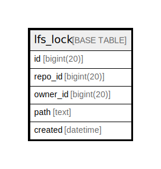

# lfs_lock

## 概要

<details>
<summary><strong>テーブル定義</strong></summary>

```sql
CREATE TABLE `lfs_lock` (
  `id` bigint(20) NOT NULL AUTO_INCREMENT,
  `repo_id` bigint(20) NOT NULL,
  `owner_id` bigint(20) NOT NULL,
  `path` text DEFAULT NULL,
  `created` datetime DEFAULT NULL,
  PRIMARY KEY (`id`),
  KEY `IDX_lfs_lock_repo_id` (`repo_id`),
  KEY `IDX_lfs_lock_owner_id` (`owner_id`)
) ENGINE=InnoDB DEFAULT CHARSET=utf8mb4 ROW_FORMAT=DYNAMIC
```

</details>

## カラム一覧

| 名前       | タイプ        | デフォルト値       | NULL許可   | Extra Definition | 子テーブル      | 親テーブル      | コメント     |
| -------- | ---------- | ------------ | -------- | ---------------- | ---------- | ---------- | -------- |
| id       | bigint(20) |              | false    | auto_increment   |            |            |          |
| repo_id  | bigint(20) |              | false    |                  |            |            |          |
| owner_id | bigint(20) |              | false    |                  |            |            |          |
| path     | text       | NULL         | true     |                  |            |            |          |
| created  | datetime   | NULL         | true     |                  |            |            |          |

## 制約一覧

| 名前      | タイプ         | 定義               |
| ------- | ----------- | ---------------- |
| PRIMARY | PRIMARY KEY | PRIMARY KEY (id) |

## INDEX一覧

| 名前                    | 定義                                               |
| --------------------- | ------------------------------------------------ |
| IDX_lfs_lock_owner_id | KEY IDX_lfs_lock_owner_id (owner_id) USING BTREE |
| IDX_lfs_lock_repo_id  | KEY IDX_lfs_lock_repo_id (repo_id) USING BTREE   |
| PRIMARY               | PRIMARY KEY (id) USING BTREE                     |

## ER図



---

> Generated by [tbls](https://github.com/k1LoW/tbls)
