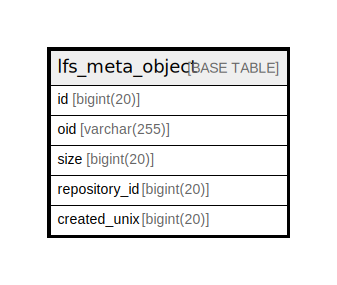

# lfs_meta_object

## 概要

<details>
<summary><strong>テーブル定義</strong></summary>

```sql
CREATE TABLE `lfs_meta_object` (
  `id` bigint(20) NOT NULL AUTO_INCREMENT,
  `oid` varchar(255) NOT NULL,
  `size` bigint(20) NOT NULL,
  `repository_id` bigint(20) NOT NULL,
  `created_unix` bigint(20) DEFAULT NULL,
  PRIMARY KEY (`id`),
  UNIQUE KEY `UQE_lfs_meta_object_s` (`oid`,`repository_id`),
  KEY `IDX_lfs_meta_object_oid` (`oid`),
  KEY `IDX_lfs_meta_object_repository_id` (`repository_id`)
) ENGINE=InnoDB DEFAULT CHARSET=utf8mb4 ROW_FORMAT=DYNAMIC
```

</details>

## カラム一覧

| 名前            | タイプ          | デフォルト値       | NULL許可   | Extra Definition | 子テーブル      | 親テーブル      | コメント     |
| ------------- | ------------ | ------------ | -------- | ---------------- | ---------- | ---------- | -------- |
| id            | bigint(20)   |              | false    | auto_increment   |            |            |          |
| oid           | varchar(255) |              | false    |                  |            |            |          |
| size          | bigint(20)   |              | false    |                  |            |            |          |
| repository_id | bigint(20)   |              | false    |                  |            |            |          |
| created_unix  | bigint(20)   | NULL         | true     |                  |            |            |          |

## 制約一覧

| 名前                    | タイプ         | 定義                                                    |
| --------------------- | ----------- | ----------------------------------------------------- |
| PRIMARY               | PRIMARY KEY | PRIMARY KEY (id)                                      |
| UQE_lfs_meta_object_s | UNIQUE      | UNIQUE KEY UQE_lfs_meta_object_s (oid, repository_id) |

## INDEX一覧

| 名前                                | 定義                                                                |
| --------------------------------- | ----------------------------------------------------------------- |
| IDX_lfs_meta_object_oid           | KEY IDX_lfs_meta_object_oid (oid) USING BTREE                     |
| IDX_lfs_meta_object_repository_id | KEY IDX_lfs_meta_object_repository_id (repository_id) USING BTREE |
| PRIMARY                           | PRIMARY KEY (id) USING BTREE                                      |
| UQE_lfs_meta_object_s             | UNIQUE KEY UQE_lfs_meta_object_s (oid, repository_id) USING BTREE |

## ER図



---

> Generated by [tbls](https://github.com/k1LoW/tbls)
