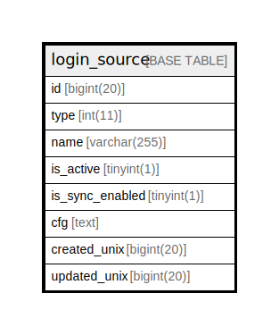

# login_source

## 概要

<details>
<summary><strong>テーブル定義</strong></summary>

```sql
CREATE TABLE `login_source` (
  `id` bigint(20) NOT NULL AUTO_INCREMENT,
  `type` int(11) DEFAULT NULL,
  `name` varchar(255) DEFAULT NULL,
  `is_active` tinyint(1) NOT NULL DEFAULT 0,
  `is_sync_enabled` tinyint(1) NOT NULL DEFAULT 0,
  `cfg` text DEFAULT NULL,
  `created_unix` bigint(20) DEFAULT NULL,
  `updated_unix` bigint(20) DEFAULT NULL,
  PRIMARY KEY (`id`),
  UNIQUE KEY `UQE_login_source_name` (`name`),
  KEY `IDX_login_source_is_active` (`is_active`),
  KEY `IDX_login_source_is_sync_enabled` (`is_sync_enabled`),
  KEY `IDX_login_source_created_unix` (`created_unix`),
  KEY `IDX_login_source_updated_unix` (`updated_unix`)
) ENGINE=InnoDB DEFAULT CHARSET=utf8mb4 ROW_FORMAT=DYNAMIC
```

</details>

## カラム一覧

| 名前              | タイプ          | デフォルト値       | NULL許可   | Extra Definition | 子テーブル      | 親テーブル      | コメント     |
| --------------- | ------------ | ------------ | -------- | ---------------- | ---------- | ---------- | -------- |
| id              | bigint(20)   |              | false    | auto_increment   |            |            |          |
| type            | int(11)      | NULL         | true     |                  |            |            |          |
| name            | varchar(255) | NULL         | true     |                  |            |            |          |
| is_active       | tinyint(1)   | 0            | false    |                  |            |            |          |
| is_sync_enabled | tinyint(1)   | 0            | false    |                  |            |            |          |
| cfg             | text         | NULL         | true     |                  |            |            |          |
| created_unix    | bigint(20)   | NULL         | true     |                  |            |            |          |
| updated_unix    | bigint(20)   | NULL         | true     |                  |            |            |          |

## 制約一覧

| 名前                    | タイプ         | 定義                                      |
| --------------------- | ----------- | --------------------------------------- |
| PRIMARY               | PRIMARY KEY | PRIMARY KEY (id)                        |
| UQE_login_source_name | UNIQUE      | UNIQUE KEY UQE_login_source_name (name) |

## INDEX一覧

| 名前                               | 定義                                                                 |
| -------------------------------- | ------------------------------------------------------------------ |
| IDX_login_source_created_unix    | KEY IDX_login_source_created_unix (created_unix) USING BTREE       |
| IDX_login_source_is_active       | KEY IDX_login_source_is_active (is_active) USING BTREE             |
| IDX_login_source_is_sync_enabled | KEY IDX_login_source_is_sync_enabled (is_sync_enabled) USING BTREE |
| IDX_login_source_updated_unix    | KEY IDX_login_source_updated_unix (updated_unix) USING BTREE       |
| PRIMARY                          | PRIMARY KEY (id) USING BTREE                                       |
| UQE_login_source_name            | UNIQUE KEY UQE_login_source_name (name) USING BTREE                |

## ER図



---

> Generated by [tbls](https://github.com/k1LoW/tbls)
