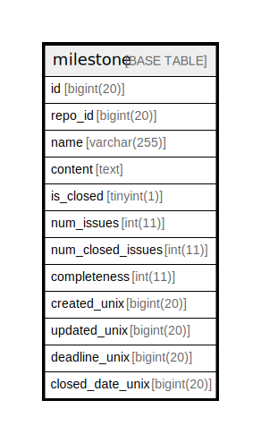

# milestone

## 概要

<details>
<summary><strong>テーブル定義</strong></summary>

```sql
CREATE TABLE `milestone` (
  `id` bigint(20) NOT NULL AUTO_INCREMENT,
  `repo_id` bigint(20) DEFAULT NULL,
  `name` varchar(255) DEFAULT NULL,
  `content` text DEFAULT NULL,
  `is_closed` tinyint(1) DEFAULT NULL,
  `num_issues` int(11) DEFAULT NULL,
  `num_closed_issues` int(11) DEFAULT NULL,
  `completeness` int(11) DEFAULT NULL,
  `created_unix` bigint(20) DEFAULT NULL,
  `updated_unix` bigint(20) DEFAULT NULL,
  `deadline_unix` bigint(20) DEFAULT NULL,
  `closed_date_unix` bigint(20) DEFAULT NULL,
  PRIMARY KEY (`id`),
  KEY `IDX_milestone_updated_unix` (`updated_unix`),
  KEY `IDX_milestone_repo_id` (`repo_id`),
  KEY `IDX_milestone_created_unix` (`created_unix`)
) ENGINE=InnoDB DEFAULT CHARSET=utf8mb4 ROW_FORMAT=DYNAMIC
```

</details>

## カラム一覧

| 名前                | タイプ          | デフォルト値       | NULL許可   | Extra Definition | 子テーブル      | 親テーブル      | コメント     |
| ----------------- | ------------ | ------------ | -------- | ---------------- | ---------- | ---------- | -------- |
| id                | bigint(20)   |              | false    | auto_increment   |            |            |          |
| repo_id           | bigint(20)   | NULL         | true     |                  |            |            |          |
| name              | varchar(255) | NULL         | true     |                  |            |            |          |
| content           | text         | NULL         | true     |                  |            |            |          |
| is_closed         | tinyint(1)   | NULL         | true     |                  |            |            |          |
| num_issues        | int(11)      | NULL         | true     |                  |            |            |          |
| num_closed_issues | int(11)      | NULL         | true     |                  |            |            |          |
| completeness      | int(11)      | NULL         | true     |                  |            |            |          |
| created_unix      | bigint(20)   | NULL         | true     |                  |            |            |          |
| updated_unix      | bigint(20)   | NULL         | true     |                  |            |            |          |
| deadline_unix     | bigint(20)   | NULL         | true     |                  |            |            |          |
| closed_date_unix  | bigint(20)   | NULL         | true     |                  |            |            |          |

## 制約一覧

| 名前      | タイプ         | 定義               |
| ------- | ----------- | ---------------- |
| PRIMARY | PRIMARY KEY | PRIMARY KEY (id) |

## INDEX一覧

| 名前                         | 定義                                                        |
| -------------------------- | --------------------------------------------------------- |
| IDX_milestone_created_unix | KEY IDX_milestone_created_unix (created_unix) USING BTREE |
| IDX_milestone_repo_id      | KEY IDX_milestone_repo_id (repo_id) USING BTREE           |
| IDX_milestone_updated_unix | KEY IDX_milestone_updated_unix (updated_unix) USING BTREE |
| PRIMARY                    | PRIMARY KEY (id) USING BTREE                              |

## ER図



---

> Generated by [tbls](https://github.com/k1LoW/tbls)
