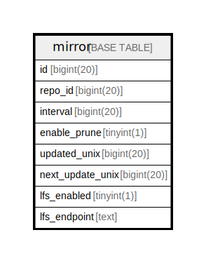

# mirror

## 概要

<details>
<summary><strong>テーブル定義</strong></summary>

```sql
CREATE TABLE `mirror` (
  `id` bigint(20) NOT NULL AUTO_INCREMENT,
  `repo_id` bigint(20) DEFAULT NULL,
  `interval` bigint(20) DEFAULT NULL,
  `enable_prune` tinyint(1) NOT NULL DEFAULT 1,
  `updated_unix` bigint(20) DEFAULT NULL,
  `next_update_unix` bigint(20) DEFAULT NULL,
  `lfs_enabled` tinyint(1) NOT NULL DEFAULT 0,
  `lfs_endpoint` text DEFAULT NULL,
  PRIMARY KEY (`id`),
  KEY `IDX_mirror_repo_id` (`repo_id`),
  KEY `IDX_mirror_updated_unix` (`updated_unix`),
  KEY `IDX_mirror_next_update_unix` (`next_update_unix`)
) ENGINE=InnoDB DEFAULT CHARSET=utf8mb4 ROW_FORMAT=DYNAMIC
```

</details>

## カラム一覧

| 名前               | タイプ        | デフォルト値       | NULL許可   | Extra Definition | 子テーブル      | 親テーブル      | コメント     |
| ---------------- | ---------- | ------------ | -------- | ---------------- | ---------- | ---------- | -------- |
| id               | bigint(20) |              | false    | auto_increment   |            |            |          |
| repo_id          | bigint(20) | NULL         | true     |                  |            |            |          |
| interval         | bigint(20) | NULL         | true     |                  |            |            |          |
| enable_prune     | tinyint(1) | 1            | false    |                  |            |            |          |
| updated_unix     | bigint(20) | NULL         | true     |                  |            |            |          |
| next_update_unix | bigint(20) | NULL         | true     |                  |            |            |          |
| lfs_enabled      | tinyint(1) | 0            | false    |                  |            |            |          |
| lfs_endpoint     | text       | NULL         | true     |                  |            |            |          |

## 制約一覧

| 名前      | タイプ         | 定義               |
| ------- | ----------- | ---------------- |
| PRIMARY | PRIMARY KEY | PRIMARY KEY (id) |

## INDEX一覧

| 名前                          | 定義                                                             |
| --------------------------- | -------------------------------------------------------------- |
| IDX_mirror_next_update_unix | KEY IDX_mirror_next_update_unix (next_update_unix) USING BTREE |
| IDX_mirror_repo_id          | KEY IDX_mirror_repo_id (repo_id) USING BTREE                   |
| IDX_mirror_updated_unix     | KEY IDX_mirror_updated_unix (updated_unix) USING BTREE         |
| PRIMARY                     | PRIMARY KEY (id) USING BTREE                                   |

## ER図



---

> Generated by [tbls](https://github.com/k1LoW/tbls)
