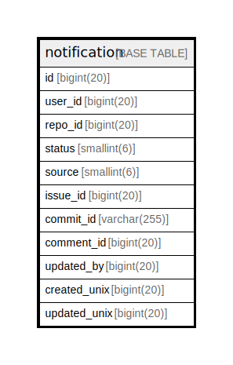

# notification

## 概要

<details>
<summary><strong>テーブル定義</strong></summary>

```sql
CREATE TABLE `notification` (
  `id` bigint(20) NOT NULL AUTO_INCREMENT,
  `user_id` bigint(20) NOT NULL,
  `repo_id` bigint(20) NOT NULL,
  `status` smallint(6) NOT NULL,
  `source` smallint(6) NOT NULL,
  `issue_id` bigint(20) NOT NULL,
  `commit_id` varchar(255) DEFAULT NULL,
  `comment_id` bigint(20) DEFAULT NULL,
  `updated_by` bigint(20) NOT NULL,
  `created_unix` bigint(20) NOT NULL,
  `updated_unix` bigint(20) NOT NULL,
  PRIMARY KEY (`id`),
  KEY `IDX_notification_created_unix` (`created_unix`),
  KEY `IDX_notification_repo_id` (`repo_id`),
  KEY `IDX_notification_status` (`status`),
  KEY `IDX_notification_source` (`source`),
  KEY `IDX_notification_commit_id` (`commit_id`),
  KEY `IDX_notification_user_id` (`user_id`),
  KEY `IDX_notification_issue_id` (`issue_id`),
  KEY `IDX_notification_updated_by` (`updated_by`),
  KEY `IDX_notification_updated_unix` (`updated_unix`)
) ENGINE=InnoDB DEFAULT CHARSET=utf8mb4 ROW_FORMAT=DYNAMIC
```

</details>

## カラム一覧

| 名前           | タイプ          | デフォルト値       | NULL許可   | Extra Definition | 子テーブル      | 親テーブル      | コメント     |
| ------------ | ------------ | ------------ | -------- | ---------------- | ---------- | ---------- | -------- |
| id           | bigint(20)   |              | false    | auto_increment   |            |            |          |
| user_id      | bigint(20)   |              | false    |                  |            |            |          |
| repo_id      | bigint(20)   |              | false    |                  |            |            |          |
| status       | smallint(6)  |              | false    |                  |            |            |          |
| source       | smallint(6)  |              | false    |                  |            |            |          |
| issue_id     | bigint(20)   |              | false    |                  |            |            |          |
| commit_id    | varchar(255) | NULL         | true     |                  |            |            |          |
| comment_id   | bigint(20)   | NULL         | true     |                  |            |            |          |
| updated_by   | bigint(20)   |              | false    |                  |            |            |          |
| created_unix | bigint(20)   |              | false    |                  |            |            |          |
| updated_unix | bigint(20)   |              | false    |                  |            |            |          |

## 制約一覧

| 名前      | タイプ         | 定義               |
| ------- | ----------- | ---------------- |
| PRIMARY | PRIMARY KEY | PRIMARY KEY (id) |

## INDEX一覧

| 名前                            | 定義                                                           |
| ----------------------------- | ------------------------------------------------------------ |
| IDX_notification_commit_id    | KEY IDX_notification_commit_id (commit_id) USING BTREE       |
| IDX_notification_created_unix | KEY IDX_notification_created_unix (created_unix) USING BTREE |
| IDX_notification_issue_id     | KEY IDX_notification_issue_id (issue_id) USING BTREE         |
| IDX_notification_repo_id      | KEY IDX_notification_repo_id (repo_id) USING BTREE           |
| IDX_notification_source       | KEY IDX_notification_source (source) USING BTREE             |
| IDX_notification_status       | KEY IDX_notification_status (status) USING BTREE             |
| IDX_notification_updated_by   | KEY IDX_notification_updated_by (updated_by) USING BTREE     |
| IDX_notification_updated_unix | KEY IDX_notification_updated_unix (updated_unix) USING BTREE |
| IDX_notification_user_id      | KEY IDX_notification_user_id (user_id) USING BTREE           |
| PRIMARY                       | PRIMARY KEY (id) USING BTREE                                 |

## ER図



---

> Generated by [tbls](https://github.com/k1LoW/tbls)
