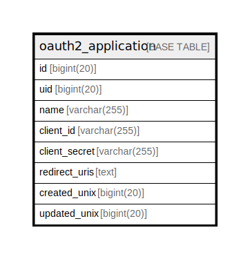

# oauth2_application

## 概要

<details>
<summary><strong>テーブル定義</strong></summary>

```sql
CREATE TABLE `oauth2_application` (
  `id` bigint(20) NOT NULL AUTO_INCREMENT,
  `uid` bigint(20) DEFAULT NULL,
  `name` varchar(255) DEFAULT NULL,
  `client_id` varchar(255) DEFAULT NULL,
  `client_secret` varchar(255) DEFAULT NULL,
  `redirect_uris` text DEFAULT NULL,
  `created_unix` bigint(20) DEFAULT NULL,
  `updated_unix` bigint(20) DEFAULT NULL,
  PRIMARY KEY (`id`),
  UNIQUE KEY `UQE_oauth2_application_client_id` (`client_id`),
  KEY `IDX_oauth2_application_updated_unix` (`updated_unix`),
  KEY `IDX_oauth2_application_uid` (`uid`),
  KEY `IDX_oauth2_application_created_unix` (`created_unix`)
) ENGINE=InnoDB DEFAULT CHARSET=utf8mb4 ROW_FORMAT=DYNAMIC
```

</details>

## カラム一覧

| 名前            | タイプ          | デフォルト値       | NULL許可   | Extra Definition | 子テーブル      | 親テーブル      | コメント     |
| ------------- | ------------ | ------------ | -------- | ---------------- | ---------- | ---------- | -------- |
| id            | bigint(20)   |              | false    | auto_increment   |            |            |          |
| uid           | bigint(20)   | NULL         | true     |                  |            |            |          |
| name          | varchar(255) | NULL         | true     |                  |            |            |          |
| client_id     | varchar(255) | NULL         | true     |                  |            |            |          |
| client_secret | varchar(255) | NULL         | true     |                  |            |            |          |
| redirect_uris | text         | NULL         | true     |                  |            |            |          |
| created_unix  | bigint(20)   | NULL         | true     |                  |            |            |          |
| updated_unix  | bigint(20)   | NULL         | true     |                  |            |            |          |

## 制約一覧

| 名前                               | タイプ         | 定義                                                      |
| -------------------------------- | ----------- | ------------------------------------------------------- |
| PRIMARY                          | PRIMARY KEY | PRIMARY KEY (id)                                        |
| UQE_oauth2_application_client_id | UNIQUE      | UNIQUE KEY UQE_oauth2_application_client_id (client_id) |

## INDEX一覧

| 名前                                  | 定義                                                                  |
| ----------------------------------- | ------------------------------------------------------------------- |
| IDX_oauth2_application_created_unix | KEY IDX_oauth2_application_created_unix (created_unix) USING BTREE  |
| IDX_oauth2_application_uid          | KEY IDX_oauth2_application_uid (uid) USING BTREE                    |
| IDX_oauth2_application_updated_unix | KEY IDX_oauth2_application_updated_unix (updated_unix) USING BTREE  |
| PRIMARY                             | PRIMARY KEY (id) USING BTREE                                        |
| UQE_oauth2_application_client_id    | UNIQUE KEY UQE_oauth2_application_client_id (client_id) USING BTREE |

## ER図



---

> Generated by [tbls](https://github.com/k1LoW/tbls)
