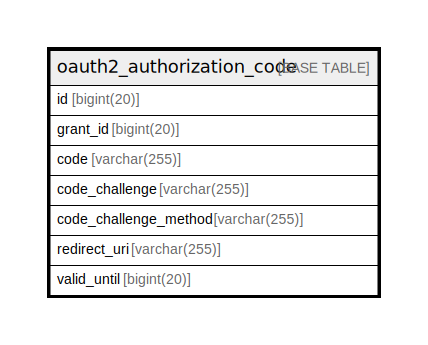

# oauth2_authorization_code

## 概要

<details>
<summary><strong>テーブル定義</strong></summary>

```sql
CREATE TABLE `oauth2_authorization_code` (
  `id` bigint(20) NOT NULL AUTO_INCREMENT,
  `grant_id` bigint(20) DEFAULT NULL,
  `code` varchar(255) DEFAULT NULL,
  `code_challenge` varchar(255) DEFAULT NULL,
  `code_challenge_method` varchar(255) DEFAULT NULL,
  `redirect_uri` varchar(255) DEFAULT NULL,
  `valid_until` bigint(20) DEFAULT NULL,
  PRIMARY KEY (`id`),
  UNIQUE KEY `UQE_oauth2_authorization_code_code` (`code`),
  KEY `IDX_oauth2_authorization_code_valid_until` (`valid_until`)
) ENGINE=InnoDB DEFAULT CHARSET=utf8mb4 ROW_FORMAT=DYNAMIC
```

</details>

## カラム一覧

| 名前                    | タイプ          | デフォルト値       | NULL許可   | Extra Definition | 子テーブル      | 親テーブル      | コメント     |
| --------------------- | ------------ | ------------ | -------- | ---------------- | ---------- | ---------- | -------- |
| id                    | bigint(20)   |              | false    | auto_increment   |            |            |          |
| grant_id              | bigint(20)   | NULL         | true     |                  |            |            |          |
| code                  | varchar(255) | NULL         | true     |                  |            |            |          |
| code_challenge        | varchar(255) | NULL         | true     |                  |            |            |          |
| code_challenge_method | varchar(255) | NULL         | true     |                  |            |            |          |
| redirect_uri          | varchar(255) | NULL         | true     |                  |            |            |          |
| valid_until           | bigint(20)   | NULL         | true     |                  |            |            |          |

## 制約一覧

| 名前                                 | タイプ         | 定義                                                   |
| ---------------------------------- | ----------- | ---------------------------------------------------- |
| PRIMARY                            | PRIMARY KEY | PRIMARY KEY (id)                                     |
| UQE_oauth2_authorization_code_code | UNIQUE      | UNIQUE KEY UQE_oauth2_authorization_code_code (code) |

## INDEX一覧

| 名前                                        | 定義                                                                      |
| ----------------------------------------- | ----------------------------------------------------------------------- |
| IDX_oauth2_authorization_code_valid_until | KEY IDX_oauth2_authorization_code_valid_until (valid_until) USING BTREE |
| PRIMARY                                   | PRIMARY KEY (id) USING BTREE                                            |
| UQE_oauth2_authorization_code_code        | UNIQUE KEY UQE_oauth2_authorization_code_code (code) USING BTREE        |

## ER図



---

> Generated by [tbls](https://github.com/k1LoW/tbls)
