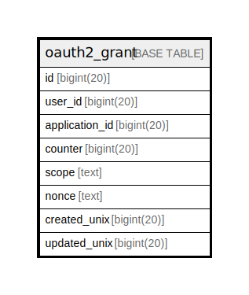

# oauth2_grant

## 概要

<details>
<summary><strong>テーブル定義</strong></summary>

```sql
CREATE TABLE `oauth2_grant` (
  `id` bigint(20) NOT NULL AUTO_INCREMENT,
  `user_id` bigint(20) DEFAULT NULL,
  `application_id` bigint(20) DEFAULT NULL,
  `counter` bigint(20) NOT NULL DEFAULT 1,
  `scope` text DEFAULT NULL,
  `nonce` text DEFAULT NULL,
  `created_unix` bigint(20) DEFAULT NULL,
  `updated_unix` bigint(20) DEFAULT NULL,
  PRIMARY KEY (`id`),
  UNIQUE KEY `UQE_oauth2_grant_user_application` (`user_id`,`application_id`),
  KEY `IDX_oauth2_grant_application_id` (`application_id`),
  KEY `IDX_oauth2_grant_user_id` (`user_id`)
) ENGINE=InnoDB DEFAULT CHARSET=utf8mb4 ROW_FORMAT=DYNAMIC
```

</details>

## カラム一覧

| 名前             | タイプ        | デフォルト値       | NULL許可   | Extra Definition | 子テーブル      | 親テーブル      | コメント     |
| -------------- | ---------- | ------------ | -------- | ---------------- | ---------- | ---------- | -------- |
| id             | bigint(20) |              | false    | auto_increment   |            |            |          |
| user_id        | bigint(20) | NULL         | true     |                  |            |            |          |
| application_id | bigint(20) | NULL         | true     |                  |            |            |          |
| counter        | bigint(20) | 1            | false    |                  |            |            |          |
| scope          | text       | NULL         | true     |                  |            |            |          |
| nonce          | text       | NULL         | true     |                  |            |            |          |
| created_unix   | bigint(20) | NULL         | true     |                  |            |            |          |
| updated_unix   | bigint(20) | NULL         | true     |                  |            |            |          |

## 制約一覧

| 名前                                | タイプ         | 定義                                                                     |
| --------------------------------- | ----------- | ---------------------------------------------------------------------- |
| PRIMARY                           | PRIMARY KEY | PRIMARY KEY (id)                                                       |
| UQE_oauth2_grant_user_application | UNIQUE      | UNIQUE KEY UQE_oauth2_grant_user_application (user_id, application_id) |

## INDEX一覧

| 名前                                | 定義                                                                                 |
| --------------------------------- | ---------------------------------------------------------------------------------- |
| IDX_oauth2_grant_application_id   | KEY IDX_oauth2_grant_application_id (application_id) USING BTREE                   |
| IDX_oauth2_grant_user_id          | KEY IDX_oauth2_grant_user_id (user_id) USING BTREE                                 |
| PRIMARY                           | PRIMARY KEY (id) USING BTREE                                                       |
| UQE_oauth2_grant_user_application | UNIQUE KEY UQE_oauth2_grant_user_application (user_id, application_id) USING BTREE |

## ER図



---

> Generated by [tbls](https://github.com/k1LoW/tbls)
