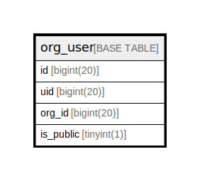

# org_user

## 概要

<details>
<summary><strong>テーブル定義</strong></summary>

```sql
CREATE TABLE `org_user` (
  `id` bigint(20) NOT NULL AUTO_INCREMENT,
  `uid` bigint(20) DEFAULT NULL,
  `org_id` bigint(20) DEFAULT NULL,
  `is_public` tinyint(1) DEFAULT NULL,
  PRIMARY KEY (`id`),
  UNIQUE KEY `UQE_org_user_s` (`uid`,`org_id`),
  KEY `IDX_org_user_is_public` (`is_public`),
  KEY `IDX_org_user_uid` (`uid`),
  KEY `IDX_org_user_org_id` (`org_id`)
) ENGINE=InnoDB DEFAULT CHARSET=utf8mb4 ROW_FORMAT=DYNAMIC
```

</details>

## カラム一覧

| 名前        | タイプ        | デフォルト値       | NULL許可   | Extra Definition | 子テーブル      | 親テーブル      | コメント     |
| --------- | ---------- | ------------ | -------- | ---------------- | ---------- | ---------- | -------- |
| id        | bigint(20) |              | false    | auto_increment   |            |            |          |
| uid       | bigint(20) | NULL         | true     |                  |            |            |          |
| org_id    | bigint(20) | NULL         | true     |                  |            |            |          |
| is_public | tinyint(1) | NULL         | true     |                  |            |            |          |

## 制約一覧

| 名前             | タイプ         | 定義                                      |
| -------------- | ----------- | --------------------------------------- |
| PRIMARY        | PRIMARY KEY | PRIMARY KEY (id)                        |
| UQE_org_user_s | UNIQUE      | UNIQUE KEY UQE_org_user_s (uid, org_id) |

## INDEX一覧

| 名前                     | 定義                                                  |
| ---------------------- | --------------------------------------------------- |
| IDX_org_user_is_public | KEY IDX_org_user_is_public (is_public) USING BTREE  |
| IDX_org_user_org_id    | KEY IDX_org_user_org_id (org_id) USING BTREE        |
| IDX_org_user_uid       | KEY IDX_org_user_uid (uid) USING BTREE              |
| PRIMARY                | PRIMARY KEY (id) USING BTREE                        |
| UQE_org_user_s         | UNIQUE KEY UQE_org_user_s (uid, org_id) USING BTREE |

## ER図



---

> Generated by [tbls](https://github.com/k1LoW/tbls)
