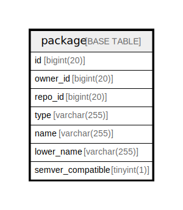

# package

## 概要

<details>
<summary><strong>テーブル定義</strong></summary>

```sql
CREATE TABLE `package` (
  `id` bigint(20) NOT NULL AUTO_INCREMENT,
  `owner_id` bigint(20) NOT NULL,
  `repo_id` bigint(20) DEFAULT NULL,
  `type` varchar(255) NOT NULL,
  `name` varchar(255) NOT NULL,
  `lower_name` varchar(255) NOT NULL,
  `semver_compatible` tinyint(1) NOT NULL DEFAULT 0,
  PRIMARY KEY (`id`),
  UNIQUE KEY `UQE_package_s` (`owner_id`,`type`,`lower_name`),
  KEY `IDX_package_owner_id` (`owner_id`),
  KEY `IDX_package_repo_id` (`repo_id`),
  KEY `IDX_package_type` (`type`),
  KEY `IDX_package_lower_name` (`lower_name`)
) ENGINE=InnoDB DEFAULT CHARSET=utf8mb4 ROW_FORMAT=DYNAMIC
```

</details>

## カラム一覧

| 名前                | タイプ          | デフォルト値       | NULL許可   | Extra Definition | 子テーブル      | 親テーブル      | コメント     |
| ----------------- | ------------ | ------------ | -------- | ---------------- | ---------- | ---------- | -------- |
| id                | bigint(20)   |              | false    | auto_increment   |            |            |          |
| owner_id          | bigint(20)   |              | false    |                  |            |            |          |
| repo_id           | bigint(20)   | NULL         | true     |                  |            |            |          |
| type              | varchar(255) |              | false    |                  |            |            |          |
| name              | varchar(255) |              | false    |                  |            |            |          |
| lower_name        | varchar(255) |              | false    |                  |            |            |          |
| semver_compatible | tinyint(1)   | 0            | false    |                  |            |            |          |

## 制約一覧

| 名前            | タイプ         | 定義                                                    |
| ------------- | ----------- | ----------------------------------------------------- |
| PRIMARY       | PRIMARY KEY | PRIMARY KEY (id)                                      |
| UQE_package_s | UNIQUE      | UNIQUE KEY UQE_package_s (owner_id, type, lower_name) |

## INDEX一覧

| 名前                     | 定義                                                                |
| ---------------------- | ----------------------------------------------------------------- |
| IDX_package_lower_name | KEY IDX_package_lower_name (lower_name) USING BTREE               |
| IDX_package_owner_id   | KEY IDX_package_owner_id (owner_id) USING BTREE                   |
| IDX_package_repo_id    | KEY IDX_package_repo_id (repo_id) USING BTREE                     |
| IDX_package_type       | KEY IDX_package_type (type) USING BTREE                           |
| PRIMARY                | PRIMARY KEY (id) USING BTREE                                      |
| UQE_package_s          | UNIQUE KEY UQE_package_s (owner_id, type, lower_name) USING BTREE |

## ER図



---

> Generated by [tbls](https://github.com/k1LoW/tbls)
