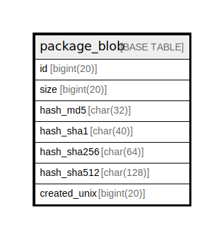

# package_blob

## 概要

<details>
<summary><strong>テーブル定義</strong></summary>

```sql
CREATE TABLE `package_blob` (
  `id` bigint(20) NOT NULL AUTO_INCREMENT,
  `size` bigint(20) NOT NULL DEFAULT 0,
  `hash_md5` char(32) NOT NULL,
  `hash_sha1` char(40) NOT NULL,
  `hash_sha256` char(64) NOT NULL,
  `hash_sha512` char(128) NOT NULL,
  `created_unix` bigint(20) NOT NULL,
  PRIMARY KEY (`id`),
  UNIQUE KEY `UQE_package_blob_sha1` (`hash_sha1`),
  UNIQUE KEY `UQE_package_blob_md5` (`hash_md5`),
  UNIQUE KEY `UQE_package_blob_sha256` (`hash_sha256`),
  UNIQUE KEY `UQE_package_blob_sha512` (`hash_sha512`),
  KEY `IDX_package_blob_hash_md5` (`hash_md5`),
  KEY `IDX_package_blob_hash_sha1` (`hash_sha1`),
  KEY `IDX_package_blob_hash_sha512` (`hash_sha512`),
  KEY `IDX_package_blob_created_unix` (`created_unix`),
  KEY `IDX_package_blob_hash_sha256` (`hash_sha256`)
) ENGINE=InnoDB DEFAULT CHARSET=utf8mb4 ROW_FORMAT=DYNAMIC
```

</details>

## カラム一覧

| 名前           | タイプ        | デフォルト値       | NULL許可   | Extra Definition | 子テーブル      | 親テーブル      | コメント     |
| ------------ | ---------- | ------------ | -------- | ---------------- | ---------- | ---------- | -------- |
| id           | bigint(20) |              | false    | auto_increment   |            |            |          |
| size         | bigint(20) | 0            | false    |                  |            |            |          |
| hash_md5     | char(32)   |              | false    |                  |            |            |          |
| hash_sha1    | char(40)   |              | false    |                  |            |            |          |
| hash_sha256  | char(64)   |              | false    |                  |            |            |          |
| hash_sha512  | char(128)  |              | false    |                  |            |            |          |
| created_unix | bigint(20) |              | false    |                  |            |            |          |

## 制約一覧

| 名前                      | タイプ         | 定義                                               |
| ----------------------- | ----------- | ------------------------------------------------ |
| PRIMARY                 | PRIMARY KEY | PRIMARY KEY (id)                                 |
| UQE_package_blob_md5    | UNIQUE      | UNIQUE KEY UQE_package_blob_md5 (hash_md5)       |
| UQE_package_blob_sha1   | UNIQUE      | UNIQUE KEY UQE_package_blob_sha1 (hash_sha1)     |
| UQE_package_blob_sha256 | UNIQUE      | UNIQUE KEY UQE_package_blob_sha256 (hash_sha256) |
| UQE_package_blob_sha512 | UNIQUE      | UNIQUE KEY UQE_package_blob_sha512 (hash_sha512) |

## INDEX一覧

| 名前                            | 定義                                                           |
| ----------------------------- | ------------------------------------------------------------ |
| IDX_package_blob_created_unix | KEY IDX_package_blob_created_unix (created_unix) USING BTREE |
| IDX_package_blob_hash_md5     | KEY IDX_package_blob_hash_md5 (hash_md5) USING BTREE         |
| IDX_package_blob_hash_sha1    | KEY IDX_package_blob_hash_sha1 (hash_sha1) USING BTREE       |
| IDX_package_blob_hash_sha256  | KEY IDX_package_blob_hash_sha256 (hash_sha256) USING BTREE   |
| IDX_package_blob_hash_sha512  | KEY IDX_package_blob_hash_sha512 (hash_sha512) USING BTREE   |
| PRIMARY                       | PRIMARY KEY (id) USING BTREE                                 |
| UQE_package_blob_md5          | UNIQUE KEY UQE_package_blob_md5 (hash_md5) USING BTREE       |
| UQE_package_blob_sha1         | UNIQUE KEY UQE_package_blob_sha1 (hash_sha1) USING BTREE     |
| UQE_package_blob_sha256       | UNIQUE KEY UQE_package_blob_sha256 (hash_sha256) USING BTREE |
| UQE_package_blob_sha512       | UNIQUE KEY UQE_package_blob_sha512 (hash_sha512) USING BTREE |

## ER図



---

> Generated by [tbls](https://github.com/k1LoW/tbls)
