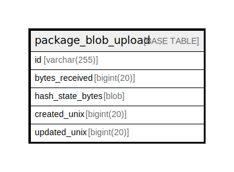

# package_blob_upload

## 概要

<details>
<summary><strong>テーブル定義</strong></summary>

```sql
CREATE TABLE `package_blob_upload` (
  `id` varchar(255) NOT NULL,
  `bytes_received` bigint(20) NOT NULL DEFAULT 0,
  `hash_state_bytes` blob DEFAULT NULL,
  `created_unix` bigint(20) NOT NULL,
  `updated_unix` bigint(20) NOT NULL,
  PRIMARY KEY (`id`),
  KEY `IDX_package_blob_upload_updated_unix` (`updated_unix`)
) ENGINE=InnoDB DEFAULT CHARSET=utf8mb4 ROW_FORMAT=DYNAMIC
```

</details>

## カラム一覧

| 名前               | タイプ          | デフォルト値       | NULL許可   | 子テーブル      | 親テーブル      | コメント     |
| ---------------- | ------------ | ------------ | -------- | ---------- | ---------- | -------- |
| id               | varchar(255) |              | false    |            |            |          |
| bytes_received   | bigint(20)   | 0            | false    |            |            |          |
| hash_state_bytes | blob         | NULL         | true     |            |            |          |
| created_unix     | bigint(20)   |              | false    |            |            |          |
| updated_unix     | bigint(20)   |              | false    |            |            |          |

## 制約一覧

| 名前      | タイプ         | 定義               |
| ------- | ----------- | ---------------- |
| PRIMARY | PRIMARY KEY | PRIMARY KEY (id) |

## INDEX一覧

| 名前                                   | 定義                                                                  |
| ------------------------------------ | ------------------------------------------------------------------- |
| IDX_package_blob_upload_updated_unix | KEY IDX_package_blob_upload_updated_unix (updated_unix) USING BTREE |
| PRIMARY                              | PRIMARY KEY (id) USING BTREE                                        |

## ER図



---

> Generated by [tbls](https://github.com/k1LoW/tbls)
