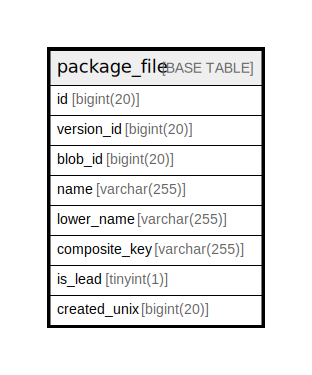

# package_file

## 概要

<details>
<summary><strong>テーブル定義</strong></summary>

```sql
CREATE TABLE `package_file` (
  `id` bigint(20) NOT NULL AUTO_INCREMENT,
  `version_id` bigint(20) NOT NULL,
  `blob_id` bigint(20) NOT NULL,
  `name` varchar(255) NOT NULL,
  `lower_name` varchar(255) NOT NULL,
  `composite_key` varchar(255) DEFAULT NULL,
  `is_lead` tinyint(1) NOT NULL DEFAULT 0,
  `created_unix` bigint(20) NOT NULL,
  PRIMARY KEY (`id`),
  UNIQUE KEY `UQE_package_file_s` (`version_id`,`lower_name`,`composite_key`),
  KEY `IDX_package_file_version_id` (`version_id`),
  KEY `IDX_package_file_blob_id` (`blob_id`),
  KEY `IDX_package_file_lower_name` (`lower_name`),
  KEY `IDX_package_file_composite_key` (`composite_key`),
  KEY `IDX_package_file_created_unix` (`created_unix`)
) ENGINE=InnoDB DEFAULT CHARSET=utf8mb4 ROW_FORMAT=DYNAMIC
```

</details>

## カラム一覧

| 名前            | タイプ          | デフォルト値       | NULL許可   | Extra Definition | 子テーブル      | 親テーブル      | コメント     |
| ------------- | ------------ | ------------ | -------- | ---------------- | ---------- | ---------- | -------- |
| id            | bigint(20)   |              | false    | auto_increment   |            |            |          |
| version_id    | bigint(20)   |              | false    |                  |            |            |          |
| blob_id       | bigint(20)   |              | false    |                  |            |            |          |
| name          | varchar(255) |              | false    |                  |            |            |          |
| lower_name    | varchar(255) |              | false    |                  |            |            |          |
| composite_key | varchar(255) | NULL         | true     |                  |            |            |          |
| is_lead       | tinyint(1)   | 0            | false    |                  |            |            |          |
| created_unix  | bigint(20)   |              | false    |                  |            |            |          |

## 制約一覧

| 名前                 | タイプ         | 定義                                                                    |
| ------------------ | ----------- | --------------------------------------------------------------------- |
| PRIMARY            | PRIMARY KEY | PRIMARY KEY (id)                                                      |
| UQE_package_file_s | UNIQUE      | UNIQUE KEY UQE_package_file_s (version_id, lower_name, composite_key) |

## INDEX一覧

| 名前                             | 定義                                                                                |
| ------------------------------ | --------------------------------------------------------------------------------- |
| IDX_package_file_blob_id       | KEY IDX_package_file_blob_id (blob_id) USING BTREE                                |
| IDX_package_file_composite_key | KEY IDX_package_file_composite_key (composite_key) USING BTREE                    |
| IDX_package_file_created_unix  | KEY IDX_package_file_created_unix (created_unix) USING BTREE                      |
| IDX_package_file_lower_name    | KEY IDX_package_file_lower_name (lower_name) USING BTREE                          |
| IDX_package_file_version_id    | KEY IDX_package_file_version_id (version_id) USING BTREE                          |
| PRIMARY                        | PRIMARY KEY (id) USING BTREE                                                      |
| UQE_package_file_s             | UNIQUE KEY UQE_package_file_s (version_id, lower_name, composite_key) USING BTREE |

## ER図



---

> Generated by [tbls](https://github.com/k1LoW/tbls)
