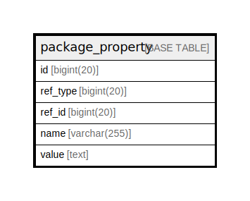

# package_property

## 概要

<details>
<summary><strong>テーブル定義</strong></summary>

```sql
CREATE TABLE `package_property` (
  `id` bigint(20) NOT NULL AUTO_INCREMENT,
  `ref_type` bigint(20) NOT NULL,
  `ref_id` bigint(20) NOT NULL,
  `name` varchar(255) NOT NULL,
  `value` text NOT NULL,
  PRIMARY KEY (`id`),
  KEY `IDX_package_property_ref_type` (`ref_type`),
  KEY `IDX_package_property_ref_id` (`ref_id`),
  KEY `IDX_package_property_name` (`name`)
) ENGINE=InnoDB DEFAULT CHARSET=utf8mb4 ROW_FORMAT=DYNAMIC
```

</details>

## カラム一覧

| 名前       | タイプ          | デフォルト値       | NULL許可   | Extra Definition | 子テーブル      | 親テーブル      | コメント     |
| -------- | ------------ | ------------ | -------- | ---------------- | ---------- | ---------- | -------- |
| id       | bigint(20)   |              | false    | auto_increment   |            |            |          |
| ref_type | bigint(20)   |              | false    |                  |            |            |          |
| ref_id   | bigint(20)   |              | false    |                  |            |            |          |
| name     | varchar(255) |              | false    |                  |            |            |          |
| value    | text         |              | false    |                  |            |            |          |

## 制約一覧

| 名前      | タイプ         | 定義               |
| ------- | ----------- | ---------------- |
| PRIMARY | PRIMARY KEY | PRIMARY KEY (id) |

## INDEX一覧

| 名前                            | 定義                                                       |
| ----------------------------- | -------------------------------------------------------- |
| IDX_package_property_name     | KEY IDX_package_property_name (name) USING BTREE         |
| IDX_package_property_ref_id   | KEY IDX_package_property_ref_id (ref_id) USING BTREE     |
| IDX_package_property_ref_type | KEY IDX_package_property_ref_type (ref_type) USING BTREE |
| PRIMARY                       | PRIMARY KEY (id) USING BTREE                             |

## ER図



---

> Generated by [tbls](https://github.com/k1LoW/tbls)
