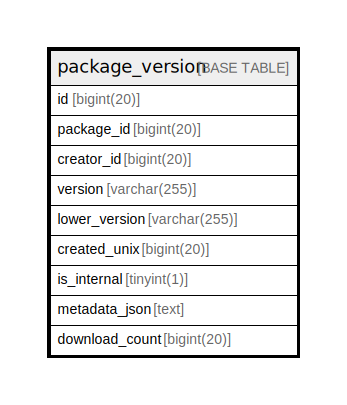

# package_version

## 概要

<details>
<summary><strong>テーブル定義</strong></summary>

```sql
CREATE TABLE `package_version` (
  `id` bigint(20) NOT NULL AUTO_INCREMENT,
  `package_id` bigint(20) NOT NULL,
  `creator_id` bigint(20) NOT NULL DEFAULT 0,
  `version` varchar(255) NOT NULL,
  `lower_version` varchar(255) NOT NULL,
  `created_unix` bigint(20) NOT NULL,
  `is_internal` tinyint(1) NOT NULL DEFAULT 0,
  `metadata_json` text DEFAULT NULL,
  `download_count` bigint(20) NOT NULL DEFAULT 0,
  PRIMARY KEY (`id`),
  UNIQUE KEY `UQE_package_version_s` (`package_id`,`lower_version`),
  KEY `IDX_package_version_package_id` (`package_id`),
  KEY `IDX_package_version_lower_version` (`lower_version`),
  KEY `IDX_package_version_created_unix` (`created_unix`),
  KEY `IDX_package_version_is_internal` (`is_internal`)
) ENGINE=InnoDB DEFAULT CHARSET=utf8mb4 ROW_FORMAT=DYNAMIC
```

</details>

## カラム一覧

| 名前             | タイプ          | デフォルト値       | NULL許可   | Extra Definition | 子テーブル      | 親テーブル      | コメント     |
| -------------- | ------------ | ------------ | -------- | ---------------- | ---------- | ---------- | -------- |
| id             | bigint(20)   |              | false    | auto_increment   |            |            |          |
| package_id     | bigint(20)   |              | false    |                  |            |            |          |
| creator_id     | bigint(20)   | 0            | false    |                  |            |            |          |
| version        | varchar(255) |              | false    |                  |            |            |          |
| lower_version  | varchar(255) |              | false    |                  |            |            |          |
| created_unix   | bigint(20)   |              | false    |                  |            |            |          |
| is_internal    | tinyint(1)   | 0            | false    |                  |            |            |          |
| metadata_json  | text         | NULL         | true     |                  |            |            |          |
| download_count | bigint(20)   | 0            | false    |                  |            |            |          |

## 制約一覧

| 名前                    | タイプ         | 定義                                                           |
| --------------------- | ----------- | ------------------------------------------------------------ |
| PRIMARY               | PRIMARY KEY | PRIMARY KEY (id)                                             |
| UQE_package_version_s | UNIQUE      | UNIQUE KEY UQE_package_version_s (package_id, lower_version) |

## INDEX一覧

| 名前                                | 定義                                                                       |
| --------------------------------- | ------------------------------------------------------------------------ |
| IDX_package_version_created_unix  | KEY IDX_package_version_created_unix (created_unix) USING BTREE          |
| IDX_package_version_is_internal   | KEY IDX_package_version_is_internal (is_internal) USING BTREE            |
| IDX_package_version_lower_version | KEY IDX_package_version_lower_version (lower_version) USING BTREE        |
| IDX_package_version_package_id    | KEY IDX_package_version_package_id (package_id) USING BTREE              |
| PRIMARY                           | PRIMARY KEY (id) USING BTREE                                             |
| UQE_package_version_s             | UNIQUE KEY UQE_package_version_s (package_id, lower_version) USING BTREE |

## ER図



---

> Generated by [tbls](https://github.com/k1LoW/tbls)
