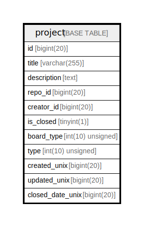

# project

## 概要

<details>
<summary><strong>テーブル定義</strong></summary>

```sql
CREATE TABLE `project` (
  `id` bigint(20) NOT NULL AUTO_INCREMENT,
  `title` varchar(255) NOT NULL,
  `description` text DEFAULT NULL,
  `repo_id` bigint(20) DEFAULT NULL,
  `creator_id` bigint(20) NOT NULL,
  `is_closed` tinyint(1) DEFAULT NULL,
  `board_type` int(10) unsigned DEFAULT NULL,
  `type` int(10) unsigned DEFAULT NULL,
  `created_unix` bigint(20) DEFAULT NULL,
  `updated_unix` bigint(20) DEFAULT NULL,
  `closed_date_unix` bigint(20) DEFAULT NULL,
  PRIMARY KEY (`id`),
  KEY `IDX_project_title` (`title`),
  KEY `IDX_project_repo_id` (`repo_id`),
  KEY `IDX_project_is_closed` (`is_closed`),
  KEY `IDX_project_created_unix` (`created_unix`),
  KEY `IDX_project_updated_unix` (`updated_unix`)
) ENGINE=InnoDB DEFAULT CHARSET=utf8mb4 ROW_FORMAT=DYNAMIC
```

</details>

## カラム一覧

| 名前               | タイプ              | デフォルト値       | NULL許可   | Extra Definition | 子テーブル      | 親テーブル      | コメント     |
| ---------------- | ---------------- | ------------ | -------- | ---------------- | ---------- | ---------- | -------- |
| id               | bigint(20)       |              | false    | auto_increment   |            |            |          |
| title            | varchar(255)     |              | false    |                  |            |            |          |
| description      | text             | NULL         | true     |                  |            |            |          |
| repo_id          | bigint(20)       | NULL         | true     |                  |            |            |          |
| creator_id       | bigint(20)       |              | false    |                  |            |            |          |
| is_closed        | tinyint(1)       | NULL         | true     |                  |            |            |          |
| board_type       | int(10) unsigned | NULL         | true     |                  |            |            |          |
| type             | int(10) unsigned | NULL         | true     |                  |            |            |          |
| created_unix     | bigint(20)       | NULL         | true     |                  |            |            |          |
| updated_unix     | bigint(20)       | NULL         | true     |                  |            |            |          |
| closed_date_unix | bigint(20)       | NULL         | true     |                  |            |            |          |

## 制約一覧

| 名前      | タイプ         | 定義               |
| ------- | ----------- | ---------------- |
| PRIMARY | PRIMARY KEY | PRIMARY KEY (id) |

## INDEX一覧

| 名前                       | 定義                                                      |
| ------------------------ | ------------------------------------------------------- |
| IDX_project_created_unix | KEY IDX_project_created_unix (created_unix) USING BTREE |
| IDX_project_is_closed    | KEY IDX_project_is_closed (is_closed) USING BTREE       |
| IDX_project_repo_id      | KEY IDX_project_repo_id (repo_id) USING BTREE           |
| IDX_project_title        | KEY IDX_project_title (title) USING BTREE               |
| IDX_project_updated_unix | KEY IDX_project_updated_unix (updated_unix) USING BTREE |
| PRIMARY                  | PRIMARY KEY (id) USING BTREE                            |

## ER図



---

> Generated by [tbls](https://github.com/k1LoW/tbls)
