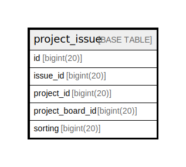

# project_issue

## 概要

<details>
<summary><strong>テーブル定義</strong></summary>

```sql
CREATE TABLE `project_issue` (
  `id` bigint(20) NOT NULL AUTO_INCREMENT,
  `issue_id` bigint(20) DEFAULT NULL,
  `project_id` bigint(20) DEFAULT NULL,
  `project_board_id` bigint(20) DEFAULT NULL,
  `sorting` bigint(20) NOT NULL DEFAULT 0,
  PRIMARY KEY (`id`),
  KEY `IDX_project_issue_issue_id` (`issue_id`),
  KEY `IDX_project_issue_project_id` (`project_id`),
  KEY `IDX_project_issue_project_board_id` (`project_board_id`)
) ENGINE=InnoDB DEFAULT CHARSET=utf8mb4 ROW_FORMAT=DYNAMIC
```

</details>

## カラム一覧

| 名前               | タイプ        | デフォルト値       | NULL許可   | Extra Definition | 子テーブル      | 親テーブル      | コメント     |
| ---------------- | ---------- | ------------ | -------- | ---------------- | ---------- | ---------- | -------- |
| id               | bigint(20) |              | false    | auto_increment   |            |            |          |
| issue_id         | bigint(20) | NULL         | true     |                  |            |            |          |
| project_id       | bigint(20) | NULL         | true     |                  |            |            |          |
| project_board_id | bigint(20) | NULL         | true     |                  |            |            |          |
| sorting          | bigint(20) | 0            | false    |                  |            |            |          |

## 制約一覧

| 名前      | タイプ         | 定義               |
| ------- | ----------- | ---------------- |
| PRIMARY | PRIMARY KEY | PRIMARY KEY (id) |

## INDEX一覧

| 名前                                 | 定義                                                                    |
| ---------------------------------- | --------------------------------------------------------------------- |
| IDX_project_issue_issue_id         | KEY IDX_project_issue_issue_id (issue_id) USING BTREE                 |
| IDX_project_issue_project_board_id | KEY IDX_project_issue_project_board_id (project_board_id) USING BTREE |
| IDX_project_issue_project_id       | KEY IDX_project_issue_project_id (project_id) USING BTREE             |
| PRIMARY                            | PRIMARY KEY (id) USING BTREE                                          |

## ER図



---

> Generated by [tbls](https://github.com/k1LoW/tbls)
