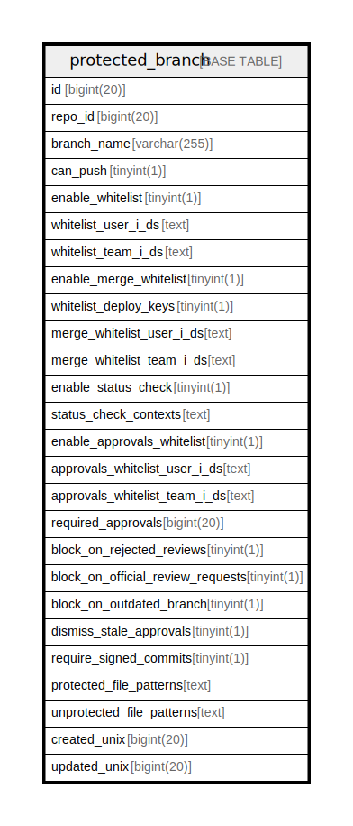

# protected_branch

## 概要

<details>
<summary><strong>テーブル定義</strong></summary>

```sql
CREATE TABLE `protected_branch` (
  `id` bigint(20) NOT NULL AUTO_INCREMENT,
  `repo_id` bigint(20) DEFAULT NULL,
  `branch_name` varchar(255) DEFAULT NULL,
  `can_push` tinyint(1) NOT NULL DEFAULT 0,
  `enable_whitelist` tinyint(1) DEFAULT NULL,
  `whitelist_user_i_ds` text DEFAULT NULL,
  `whitelist_team_i_ds` text DEFAULT NULL,
  `enable_merge_whitelist` tinyint(1) NOT NULL DEFAULT 0,
  `whitelist_deploy_keys` tinyint(1) NOT NULL DEFAULT 0,
  `merge_whitelist_user_i_ds` text DEFAULT NULL,
  `merge_whitelist_team_i_ds` text DEFAULT NULL,
  `enable_status_check` tinyint(1) NOT NULL DEFAULT 0,
  `status_check_contexts` text DEFAULT NULL,
  `enable_approvals_whitelist` tinyint(1) NOT NULL DEFAULT 0,
  `approvals_whitelist_user_i_ds` text DEFAULT NULL,
  `approvals_whitelist_team_i_ds` text DEFAULT NULL,
  `required_approvals` bigint(20) NOT NULL DEFAULT 0,
  `block_on_rejected_reviews` tinyint(1) NOT NULL DEFAULT 0,
  `block_on_official_review_requests` tinyint(1) NOT NULL DEFAULT 0,
  `block_on_outdated_branch` tinyint(1) NOT NULL DEFAULT 0,
  `dismiss_stale_approvals` tinyint(1) NOT NULL DEFAULT 0,
  `require_signed_commits` tinyint(1) NOT NULL DEFAULT 0,
  `protected_file_patterns` text DEFAULT NULL,
  `unprotected_file_patterns` text DEFAULT NULL,
  `created_unix` bigint(20) DEFAULT NULL,
  `updated_unix` bigint(20) DEFAULT NULL,
  PRIMARY KEY (`id`),
  UNIQUE KEY `UQE_protected_branch_s` (`repo_id`,`branch_name`)
) ENGINE=InnoDB DEFAULT CHARSET=utf8mb4 ROW_FORMAT=DYNAMIC
```

</details>

## カラム一覧

| 名前                                | タイプ          | デフォルト値       | NULL許可   | Extra Definition | 子テーブル      | 親テーブル      | コメント     |
| --------------------------------- | ------------ | ------------ | -------- | ---------------- | ---------- | ---------- | -------- |
| id                                | bigint(20)   |              | false    | auto_increment   |            |            |          |
| repo_id                           | bigint(20)   | NULL         | true     |                  |            |            |          |
| branch_name                       | varchar(255) | NULL         | true     |                  |            |            |          |
| can_push                          | tinyint(1)   | 0            | false    |                  |            |            |          |
| enable_whitelist                  | tinyint(1)   | NULL         | true     |                  |            |            |          |
| whitelist_user_i_ds               | text         | NULL         | true     |                  |            |            |          |
| whitelist_team_i_ds               | text         | NULL         | true     |                  |            |            |          |
| enable_merge_whitelist            | tinyint(1)   | 0            | false    |                  |            |            |          |
| whitelist_deploy_keys             | tinyint(1)   | 0            | false    |                  |            |            |          |
| merge_whitelist_user_i_ds         | text         | NULL         | true     |                  |            |            |          |
| merge_whitelist_team_i_ds         | text         | NULL         | true     |                  |            |            |          |
| enable_status_check               | tinyint(1)   | 0            | false    |                  |            |            |          |
| status_check_contexts             | text         | NULL         | true     |                  |            |            |          |
| enable_approvals_whitelist        | tinyint(1)   | 0            | false    |                  |            |            |          |
| approvals_whitelist_user_i_ds     | text         | NULL         | true     |                  |            |            |          |
| approvals_whitelist_team_i_ds     | text         | NULL         | true     |                  |            |            |          |
| required_approvals                | bigint(20)   | 0            | false    |                  |            |            |          |
| block_on_rejected_reviews         | tinyint(1)   | 0            | false    |                  |            |            |          |
| block_on_official_review_requests | tinyint(1)   | 0            | false    |                  |            |            |          |
| block_on_outdated_branch          | tinyint(1)   | 0            | false    |                  |            |            |          |
| dismiss_stale_approvals           | tinyint(1)   | 0            | false    |                  |            |            |          |
| require_signed_commits            | tinyint(1)   | 0            | false    |                  |            |            |          |
| protected_file_patterns           | text         | NULL         | true     |                  |            |            |          |
| unprotected_file_patterns         | text         | NULL         | true     |                  |            |            |          |
| created_unix                      | bigint(20)   | NULL         | true     |                  |            |            |          |
| updated_unix                      | bigint(20)   | NULL         | true     |                  |            |            |          |

## 制約一覧

| 名前                     | タイプ         | 定義                                                       |
| ---------------------- | ----------- | -------------------------------------------------------- |
| PRIMARY                | PRIMARY KEY | PRIMARY KEY (id)                                         |
| UQE_protected_branch_s | UNIQUE      | UNIQUE KEY UQE_protected_branch_s (repo_id, branch_name) |

## INDEX一覧

| 名前                     | 定義                                                                   |
| ---------------------- | -------------------------------------------------------------------- |
| PRIMARY                | PRIMARY KEY (id) USING BTREE                                         |
| UQE_protected_branch_s | UNIQUE KEY UQE_protected_branch_s (repo_id, branch_name) USING BTREE |

## ER図



---

> Generated by [tbls](https://github.com/k1LoW/tbls)
