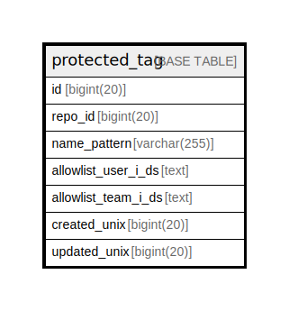

# protected_tag

## 概要

<details>
<summary><strong>テーブル定義</strong></summary>

```sql
CREATE TABLE `protected_tag` (
  `id` bigint(20) NOT NULL AUTO_INCREMENT,
  `repo_id` bigint(20) DEFAULT NULL,
  `name_pattern` varchar(255) DEFAULT NULL,
  `allowlist_user_i_ds` text DEFAULT NULL,
  `allowlist_team_i_ds` text DEFAULT NULL,
  `created_unix` bigint(20) DEFAULT NULL,
  `updated_unix` bigint(20) DEFAULT NULL,
  PRIMARY KEY (`id`)
) ENGINE=InnoDB DEFAULT CHARSET=utf8mb4 ROW_FORMAT=DYNAMIC
```

</details>

## カラム一覧

| 名前                  | タイプ          | デフォルト値       | NULL許可   | Extra Definition | 子テーブル      | 親テーブル      | コメント     |
| ------------------- | ------------ | ------------ | -------- | ---------------- | ---------- | ---------- | -------- |
| id                  | bigint(20)   |              | false    | auto_increment   |            |            |          |
| repo_id             | bigint(20)   | NULL         | true     |                  |            |            |          |
| name_pattern        | varchar(255) | NULL         | true     |                  |            |            |          |
| allowlist_user_i_ds | text         | NULL         | true     |                  |            |            |          |
| allowlist_team_i_ds | text         | NULL         | true     |                  |            |            |          |
| created_unix        | bigint(20)   | NULL         | true     |                  |            |            |          |
| updated_unix        | bigint(20)   | NULL         | true     |                  |            |            |          |

## 制約一覧

| 名前      | タイプ         | 定義               |
| ------- | ----------- | ---------------- |
| PRIMARY | PRIMARY KEY | PRIMARY KEY (id) |

## INDEX一覧

| 名前      | 定義                           |
| ------- | ---------------------------- |
| PRIMARY | PRIMARY KEY (id) USING BTREE |

## ER図



---

> Generated by [tbls](https://github.com/k1LoW/tbls)
