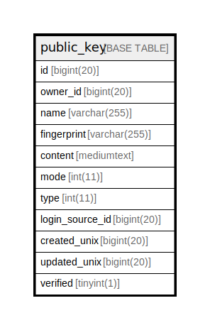

# public_key

## 概要

<details>
<summary><strong>テーブル定義</strong></summary>

```sql
CREATE TABLE `public_key` (
  `id` bigint(20) NOT NULL AUTO_INCREMENT,
  `owner_id` bigint(20) NOT NULL,
  `name` varchar(255) NOT NULL,
  `fingerprint` varchar(255) NOT NULL,
  `content` mediumtext NOT NULL,
  `mode` int(11) NOT NULL DEFAULT 2,
  `type` int(11) NOT NULL DEFAULT 1,
  `login_source_id` bigint(20) NOT NULL DEFAULT 0,
  `created_unix` bigint(20) DEFAULT NULL,
  `updated_unix` bigint(20) DEFAULT NULL,
  `verified` tinyint(1) NOT NULL DEFAULT 0,
  PRIMARY KEY (`id`),
  KEY `IDX_public_key_owner_id` (`owner_id`),
  KEY `IDX_public_key_fingerprint` (`fingerprint`)
) ENGINE=InnoDB DEFAULT CHARSET=utf8mb4 ROW_FORMAT=DYNAMIC
```

</details>

## カラム一覧

| 名前              | タイプ          | デフォルト値       | NULL許可   | Extra Definition | 子テーブル      | 親テーブル      | コメント     |
| --------------- | ------------ | ------------ | -------- | ---------------- | ---------- | ---------- | -------- |
| id              | bigint(20)   |              | false    | auto_increment   |            |            |          |
| owner_id        | bigint(20)   |              | false    |                  |            |            |          |
| name            | varchar(255) |              | false    |                  |            |            |          |
| fingerprint     | varchar(255) |              | false    |                  |            |            |          |
| content         | mediumtext   |              | false    |                  |            |            |          |
| mode            | int(11)      | 2            | false    |                  |            |            |          |
| type            | int(11)      | 1            | false    |                  |            |            |          |
| login_source_id | bigint(20)   | 0            | false    |                  |            |            |          |
| created_unix    | bigint(20)   | NULL         | true     |                  |            |            |          |
| updated_unix    | bigint(20)   | NULL         | true     |                  |            |            |          |
| verified        | tinyint(1)   | 0            | false    |                  |            |            |          |

## 制約一覧

| 名前      | タイプ         | 定義               |
| ------- | ----------- | ---------------- |
| PRIMARY | PRIMARY KEY | PRIMARY KEY (id) |

## INDEX一覧

| 名前                         | 定義                                                       |
| -------------------------- | -------------------------------------------------------- |
| IDX_public_key_fingerprint | KEY IDX_public_key_fingerprint (fingerprint) USING BTREE |
| IDX_public_key_owner_id    | KEY IDX_public_key_owner_id (owner_id) USING BTREE       |
| PRIMARY                    | PRIMARY KEY (id) USING BTREE                             |

## ER図



---

> Generated by [tbls](https://github.com/k1LoW/tbls)
