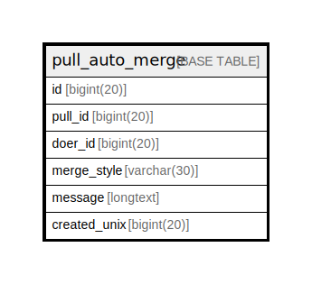

# pull_auto_merge

## 概要

<details>
<summary><strong>テーブル定義</strong></summary>

```sql
CREATE TABLE `pull_auto_merge` (
  `id` bigint(20) NOT NULL AUTO_INCREMENT,
  `pull_id` bigint(20) DEFAULT NULL,
  `doer_id` bigint(20) NOT NULL,
  `merge_style` varchar(30) DEFAULT NULL,
  `message` longtext DEFAULT NULL,
  `created_unix` bigint(20) DEFAULT NULL,
  PRIMARY KEY (`id`),
  UNIQUE KEY `UQE_pull_auto_merge_pull_id` (`pull_id`)
) ENGINE=InnoDB DEFAULT CHARSET=utf8mb4 ROW_FORMAT=DYNAMIC
```

</details>

## カラム一覧

| 名前           | タイプ         | デフォルト値       | NULL許可   | Extra Definition | 子テーブル      | 親テーブル      | コメント     |
| ------------ | ----------- | ------------ | -------- | ---------------- | ---------- | ---------- | -------- |
| id           | bigint(20)  |              | false    | auto_increment   |            |            |          |
| pull_id      | bigint(20)  | NULL         | true     |                  |            |            |          |
| doer_id      | bigint(20)  |              | false    |                  |            |            |          |
| merge_style  | varchar(30) | NULL         | true     |                  |            |            |          |
| message      | longtext    | NULL         | true     |                  |            |            |          |
| created_unix | bigint(20)  | NULL         | true     |                  |            |            |          |

## 制約一覧

| 名前                          | タイプ         | 定義                                               |
| --------------------------- | ----------- | ------------------------------------------------ |
| PRIMARY                     | PRIMARY KEY | PRIMARY KEY (id)                                 |
| UQE_pull_auto_merge_pull_id | UNIQUE      | UNIQUE KEY UQE_pull_auto_merge_pull_id (pull_id) |

## INDEX一覧

| 名前                          | 定義                                                           |
| --------------------------- | ------------------------------------------------------------ |
| PRIMARY                     | PRIMARY KEY (id) USING BTREE                                 |
| UQE_pull_auto_merge_pull_id | UNIQUE KEY UQE_pull_auto_merge_pull_id (pull_id) USING BTREE |

## ER図



---

> Generated by [tbls](https://github.com/k1LoW/tbls)
