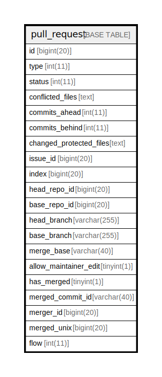

# pull_request

## 概要

<details>
<summary><strong>テーブル定義</strong></summary>

```sql
CREATE TABLE `pull_request` (
  `id` bigint(20) NOT NULL AUTO_INCREMENT,
  `type` int(11) DEFAULT NULL,
  `status` int(11) DEFAULT NULL,
  `conflicted_files` text DEFAULT NULL,
  `commits_ahead` int(11) DEFAULT NULL,
  `commits_behind` int(11) DEFAULT NULL,
  `changed_protected_files` text DEFAULT NULL,
  `issue_id` bigint(20) DEFAULT NULL,
  `index` bigint(20) DEFAULT NULL,
  `head_repo_id` bigint(20) DEFAULT NULL,
  `base_repo_id` bigint(20) DEFAULT NULL,
  `head_branch` varchar(255) DEFAULT NULL,
  `base_branch` varchar(255) DEFAULT NULL,
  `merge_base` varchar(40) DEFAULT NULL,
  `allow_maintainer_edit` tinyint(1) NOT NULL DEFAULT 0,
  `has_merged` tinyint(1) DEFAULT NULL,
  `merged_commit_id` varchar(40) DEFAULT NULL,
  `merger_id` bigint(20) DEFAULT NULL,
  `merged_unix` bigint(20) DEFAULT NULL,
  `flow` int(11) NOT NULL DEFAULT 0,
  PRIMARY KEY (`id`),
  KEY `IDX_pull_request_issue_id` (`issue_id`),
  KEY `IDX_pull_request_head_repo_id` (`head_repo_id`),
  KEY `IDX_pull_request_base_repo_id` (`base_repo_id`),
  KEY `IDX_pull_request_has_merged` (`has_merged`),
  KEY `IDX_pull_request_merger_id` (`merger_id`),
  KEY `IDX_pull_request_merged_unix` (`merged_unix`)
) ENGINE=InnoDB DEFAULT CHARSET=utf8mb4 ROW_FORMAT=DYNAMIC
```

</details>

## カラム一覧

| 名前                      | タイプ          | デフォルト値       | NULL許可   | Extra Definition | 子テーブル      | 親テーブル      | コメント     |
| ----------------------- | ------------ | ------------ | -------- | ---------------- | ---------- | ---------- | -------- |
| id                      | bigint(20)   |              | false    | auto_increment   |            |            |          |
| type                    | int(11)      | NULL         | true     |                  |            |            |          |
| status                  | int(11)      | NULL         | true     |                  |            |            |          |
| conflicted_files        | text         | NULL         | true     |                  |            |            |          |
| commits_ahead           | int(11)      | NULL         | true     |                  |            |            |          |
| commits_behind          | int(11)      | NULL         | true     |                  |            |            |          |
| changed_protected_files | text         | NULL         | true     |                  |            |            |          |
| issue_id                | bigint(20)   | NULL         | true     |                  |            |            |          |
| index                   | bigint(20)   | NULL         | true     |                  |            |            |          |
| head_repo_id            | bigint(20)   | NULL         | true     |                  |            |            |          |
| base_repo_id            | bigint(20)   | NULL         | true     |                  |            |            |          |
| head_branch             | varchar(255) | NULL         | true     |                  |            |            |          |
| base_branch             | varchar(255) | NULL         | true     |                  |            |            |          |
| merge_base              | varchar(40)  | NULL         | true     |                  |            |            |          |
| allow_maintainer_edit   | tinyint(1)   | 0            | false    |                  |            |            |          |
| has_merged              | tinyint(1)   | NULL         | true     |                  |            |            |          |
| merged_commit_id        | varchar(40)  | NULL         | true     |                  |            |            |          |
| merger_id               | bigint(20)   | NULL         | true     |                  |            |            |          |
| merged_unix             | bigint(20)   | NULL         | true     |                  |            |            |          |
| flow                    | int(11)      | 0            | false    |                  |            |            |          |

## 制約一覧

| 名前      | タイプ         | 定義               |
| ------- | ----------- | ---------------- |
| PRIMARY | PRIMARY KEY | PRIMARY KEY (id) |

## INDEX一覧

| 名前                            | 定義                                                           |
| ----------------------------- | ------------------------------------------------------------ |
| IDX_pull_request_base_repo_id | KEY IDX_pull_request_base_repo_id (base_repo_id) USING BTREE |
| IDX_pull_request_has_merged   | KEY IDX_pull_request_has_merged (has_merged) USING BTREE     |
| IDX_pull_request_head_repo_id | KEY IDX_pull_request_head_repo_id (head_repo_id) USING BTREE |
| IDX_pull_request_issue_id     | KEY IDX_pull_request_issue_id (issue_id) USING BTREE         |
| IDX_pull_request_merged_unix  | KEY IDX_pull_request_merged_unix (merged_unix) USING BTREE   |
| IDX_pull_request_merger_id    | KEY IDX_pull_request_merger_id (merger_id) USING BTREE       |
| PRIMARY                       | PRIMARY KEY (id) USING BTREE                                 |

## ER図



---

> Generated by [tbls](https://github.com/k1LoW/tbls)
