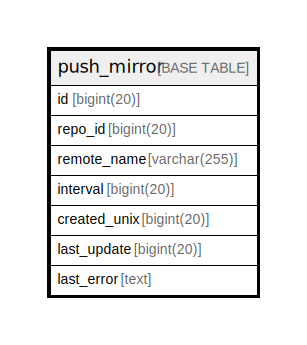

# push_mirror

## 概要

<details>
<summary><strong>テーブル定義</strong></summary>

```sql
CREATE TABLE `push_mirror` (
  `id` bigint(20) NOT NULL AUTO_INCREMENT,
  `repo_id` bigint(20) DEFAULT NULL,
  `remote_name` varchar(255) DEFAULT NULL,
  `interval` bigint(20) DEFAULT NULL,
  `created_unix` bigint(20) DEFAULT NULL,
  `last_update` bigint(20) DEFAULT NULL,
  `last_error` text DEFAULT NULL,
  PRIMARY KEY (`id`),
  KEY `IDX_push_mirror_repo_id` (`repo_id`),
  KEY `IDX_push_mirror_last_update` (`last_update`)
) ENGINE=InnoDB DEFAULT CHARSET=utf8mb4 ROW_FORMAT=DYNAMIC
```

</details>

## カラム一覧

| 名前           | タイプ          | デフォルト値       | NULL許可   | Extra Definition | 子テーブル      | 親テーブル      | コメント     |
| ------------ | ------------ | ------------ | -------- | ---------------- | ---------- | ---------- | -------- |
| id           | bigint(20)   |              | false    | auto_increment   |            |            |          |
| repo_id      | bigint(20)   | NULL         | true     |                  |            |            |          |
| remote_name  | varchar(255) | NULL         | true     |                  |            |            |          |
| interval     | bigint(20)   | NULL         | true     |                  |            |            |          |
| created_unix | bigint(20)   | NULL         | true     |                  |            |            |          |
| last_update  | bigint(20)   | NULL         | true     |                  |            |            |          |
| last_error   | text         | NULL         | true     |                  |            |            |          |

## 制約一覧

| 名前      | タイプ         | 定義               |
| ------- | ----------- | ---------------- |
| PRIMARY | PRIMARY KEY | PRIMARY KEY (id) |

## INDEX一覧

| 名前                          | 定義                                                        |
| --------------------------- | --------------------------------------------------------- |
| IDX_push_mirror_last_update | KEY IDX_push_mirror_last_update (last_update) USING BTREE |
| IDX_push_mirror_repo_id     | KEY IDX_push_mirror_repo_id (repo_id) USING BTREE         |
| PRIMARY                     | PRIMARY KEY (id) USING BTREE                              |

## ER図



---

> Generated by [tbls](https://github.com/k1LoW/tbls)
